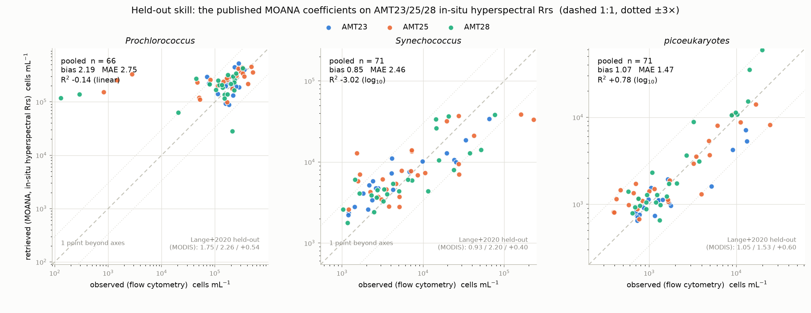

# EPFT-UP

[](https://github.com/ocean-colour/EPFT-UP/actions/workflows/ci.yml)
[](https://epft-up.readthedocs.io/en/latest/)
[](LICENSE)
<!-- DOI badge: added at the v0.1.0 Zenodo release -->

**Empirical Phytoplankton Functional Types with Uncertainty and Provenance**

EPFT-UP is an open Python framework for building, retraining and validating
*empirical* phytoplankton functional type (PFT) algorithms — models that map
hyperspectral remote-sensing reflectance (and ancillary fields such as
sea-surface temperature) to the abundance or composition of phytoplankton
groups — with per-retrieval uncertainty and end-to-end provenance as
first-class outputs. Every product carries the data, code version and
processing decisions that produced it, and every reported number is
regenerated by a script in this repository.

## What it does

- **Runs and retrains NASA's PACE MOANA algorithm** for *Prochlorococcus*,
  *Synechococcus* and picoeukaryotes, from a from-scratch Python
  reimplementation with QC flags in place of the operational code's silent
  clipping. Retrained on the AMT24 cruise, it recovers NASA's operational PCA
  basis (|cos| = 0.999 / 0.998 on the leading components) and reproduces the
  published skill within the limits of the archived training data.
- **Validates where nobody had:** the first held-out skill numbers for MOANA
  on *in-situ hyperspectral* reflectance (AMT23/25/28 — picoeukaryotes
  transfer, the two cyanobacteria do not), and a granule-level comparison
  against the shipping PACE product that settles which coefficient mapping it
  actually uses. The full account is the
  [MOANA report](reports/MOANA_Claude_Report.md).
- **Keeps the receipts.** Vendored, checksum-pinned reference tables; every
  figure and table regenerated by a script; an acceptance run that re-derives
  every published number ([`reports/moana_rederivation.md`](reports/moana_rederivation.md)).

MOANA is the first of a planned series of empirical PFT models in EPFT-UP;
each will be trained, validated and documented with the same uncertainty and
provenance machinery.



## Quickstart

One PACE OCI pixel through the MOANA retrieval (needs a free
[Earthdata](https://urs.earthdata.nasa.gov/) login in `~/.netrc`; the granule
is cached after the first call). The executable copy is
[`scripts/quickstart_moana.py`](scripts/quickstart_moana.py).

```python
import numpy as np, xarray as xr
from epft_up.moana import run_moana
from epft_up.moana.validation import fetch_pace_pair

aop_path, _ = fetch_pace_pair(date='2025-07-01')          # daily 0.1° PACE Rrs
with xr.open_dataset(aop_path) as aop:
    rrs_all, wave = aop['Rrs'].values, aop['wavelength'].values
    lat, lon = aop['lat'].values, aop['lon'].values
    iy, ix = np.nonzero(np.isfinite(rrs_all).all(axis=-1))      # cloud-free pixels
    j = np.argmin((lat[iy] - 30.0)**2 + (lon[ix] + 60.0)**2)      # nearest to 30°N 60°W
    rrs = rrs_all[iy[j], ix[j]]

out = run_moana(wave, rrs[None, :], sst=np.array([27.0]))      # SST [°C]: Pro needs it
for taxon in ('pro', 'syn', 'apeuk'):
    print(f"{taxon:6s} {out[taxon][0]:10.0f} cells/mL")
print("flags", int(out['flags'][0]))                           # 0 = clean retrieval
```

```
pro        150219 cells/mL
syn          3337 cells/mL
apeuk         893 cells/mL
flags 0
```

*Prochlorococcus* needs SST — here a nominal 27 °C; the pipeline takes it from
the cruise's underway record, and the operational product from GHRSST.

## Installation

EPFT-UP targets Python ≥ 3.12 and is developed against the `ocean14` conda
environment. All dependencies are on PyPI.

```bash
git clone https://github.com/ocean-colour/EPFT-UP.git
cd EPFT-UP
pip install -r requirements.txt
pip install -e .
```

Data-dependent code reads one directory tree rooted at `$OS_COLOR` and writes
derived products under `$OS_COLOR/EPFT-UP/`. `scripts/fetch_data.py` downloads
the public inputs (Zenodo, NASA) and checks them against pinned checksums; the
documentation's [Data page](https://epft-up.readthedocs.io/en/latest/data.html)
lists every input, its licence and how to obtain it.

## Documentation

**https://epft-up.readthedocs.io** — installation, data access, the MOANA
report and design document, the reproduction record, and the API reference.

## Citing

See [`CITATION.cff`](CITATION.cff) (GitHub's *Cite this repository* button).
A Zenodo DOI will be minted at the first release.

## Authors

J. Xavier Prochaska (UC Santa Cruz) and Claude.

## License

BSD 3-Clause — see [LICENSE](LICENSE).
