# The 2nd-derivative (SDP) approach to phytoplankton pigments from hyperspectral Rrs

**Author:** Claude (Opus 5.5), for J. Xavier Prochaska
**Status:** in progress. §3–§8 (data, reproduction, maths/statistics, diagnostics, learned weighting, uncertainty) are written; the other sections are outlines
that later Execution prompts in `claude_prompts/2nd_derivative_prompts.md` fill
in.
**Scope:** a reproduction and critique of Kramer, Siegel, Maritorena & Catlett
(2022, *RSE* **270**, 112879), "SDP", and the alternatives to it, written for any
ocean-color scientist.

---

## 1. Introduction

*(Execution #10.)* Motivation; what SDP claims; what this report tests.

## 2. Literature

*(Execution #10; the reading notes are in the prompt doc's Logs, 2026-09-28/29.)*
Catlett & Siegel 2018; Kramer & Siegel 2019; Kramer, Siegel & Graff 2020;
Kramer et al. 2022; Kramer et al. 2024; El Hourany & Kramer 2026; and Lange
et al. 2020 as a brief non-derivative comparison.

## 3. Data

### 3.1 Source and provenance

All results use the PANGAEA deposit that accompanies the paper: Kramer et al.
(2021), doi:10.1594/PANGAEA.937536, CC-BY-4.0. It is the tab-delimited
"textfile" export, downloaded 2026-10-02 to
`$OS_COLOR/PANGAEA/Kramer2022/PANGAEA_937536.tab`, with
SHA-256 `63da2981…5f910f3b`, pinned in `epft_up/sdp/data.py`. Two code
repositories are used as references only and are cloned beside the data at
pinned commits. Nothing from them is copied into EPFT-UP:

| Repository | Commit | Role |
|---|---|---|
| `sashajane19/Rrs_pigments` (MATLAB, Kramer) | `b3e3662` (2025-11-03) | A(λ),B(λ) table, a_w, GSM inversion, `rrsModelTrain.m` |
| `max-danenhower/rrs-SDP-pigments` (Python port) | `fb17c2f` (2026-07-24) | trained coefficient sheets for a numerical cross-check |

Neither repository has a LICENSE file. However, the `Rrs_pigments` README says
"all code and data in this repository are freely available for use by anyone
for any and all applications". `scripts/sdp/fetch_kramer2022.py` fetches and
verifies everything. `epft_up.sdp.data.load_kramer2022()` returns the data
with a provenance record: source, checksum, the repo commits actually checked
out, loader version and load time.

### 3.2 Contents

There are **145 samples**: the quality-controlled set of the paper. Each has
Rrs at 1 nm from 400 to 700 nm (301 bands, all positive), 27 HPLC pigment
columns, in-situ temperature and salinity, time, position and sampling depth
(0–7 m). The 13 modelled pigments are Tchla, HexFuco, ButFuco, Allo, Fuco,
Perid, Zea, DVchla, MVchlb, Chlc12, Chlc3, Neo and Viola. The deposit also
carries Tchlb, Tchlc, αβ-carotene, Diadino, Diato, MVchla, chlorophyllide,
DVchlb, Lut, phaeophytin, phaeophorbide and Pras.

**The 33 spectra removed by Kramer's visual QC are not in the deposit**, so that
step cannot be reproduced and is inherited as-is.

### 3.3 Agreement with Kramer 2022 Table 1

The per-campaign counts match **exactly** in all eight campaigns, and the
Tchla range, median and mean match to the paper's quoted precision. The one
exception is the BIOSOPE mean: 0.325 here against 0.326 in the paper, a
rounding difference. The three Polarstern legs in the deposit (ANT-XXIV/4,
ANT-XXV/1, ANT-XXVI/4: 7 + 1 + 18 samples) are the paper's "ANT" (26). Over
all samples, Tchla runs from 0.019 to 4.151 mg m⁻³ with median 0.110,
against the paper's 0.019–4.15 and 0.110.

| Campaign | N | Tchla min–max | median | mean |
|---|---|---|---|---|
| ANT | 26 | 0.033–4.151 | 0.232 | 0.648 |
| NAAMES | 11 | 0.094–0.987 | 0.496 | 0.540 |
| RemSensPOC | 27 | 0.049–1.094 | 0.090 | 0.173 |
| SABOR | 9 | 0.070–1.312 | 0.252 | 0.471 |
| Tara Oceans | 16 | 0.021–0.950 | 0.168 | 0.194 |
| Tara Med | 29 | 0.026–0.170 | 0.055 | 0.064 |
| BIOSOPE | 23 | 0.019–1.471 | 0.069 | 0.325 |
| EXPORTS | 4 | 0.172–0.292 | 0.223 | 0.228 |

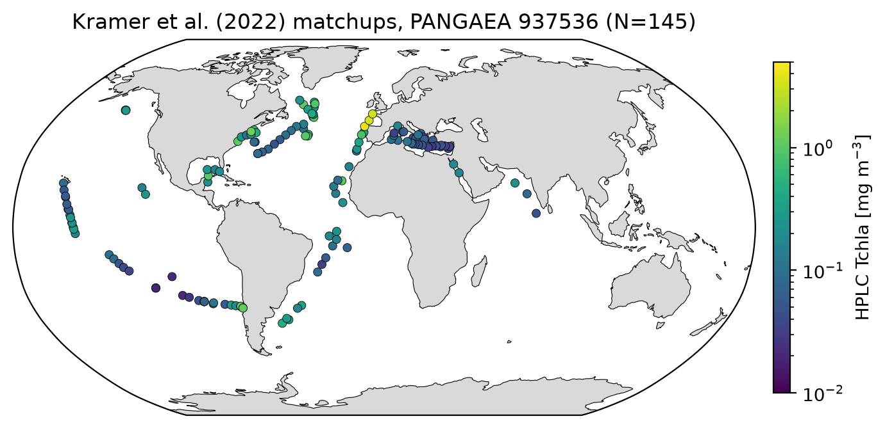
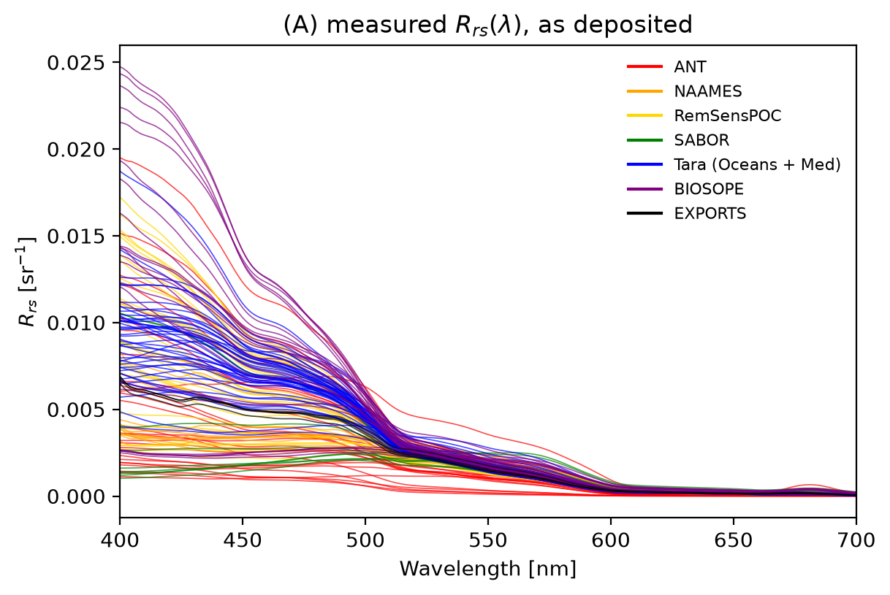

*Reproductions of Kramer 2022 Fig. 1 (locations coloured by HPLC Tchla) and
Fig. 2A (measured Rrs coloured by source); compare with the paper's panels.*

### 3.4 The deposited spectra are already smoothed and rounded

Two properties of the deposit matter for everything downstream:

1. **Rrs values are rounded to 1×10⁻⁶ sr⁻¹** (six decimals; every value lies
   on that grid). Relative to the red Rrs (median ≈1.1×10⁻⁴ sr⁻¹ at
   650–700 nm), that is about 1% quantization.
2. **The spectra were smoothed by the paper's 5 nm moving mean *before*
   rounding.** A 5-point boxcar has transfer-function zeros at 0.2 and
   0.4 cycles nm⁻¹. At exactly those frequencies, the power of the deposited
   2nd difference falls to the white-noise floor expected from the rounding:
   P_data/P_quant = 1.07 and 0.96 overall, and 0.7–1.3 in every campaign. At
   the sidelobe (0.25–0.30 cycles nm⁻¹) it stays 3–4× above the floor. Only
   periods longer than ~7 nm (below ~0.15 cycles nm⁻¹) carry signal well
   above the floor: about 8× at 0.15, 350× at 0.10, 3×10⁴ at 0.05.

Consequences: the δRrs reproduction (Execution #2) must **not** apply the 5 nm
moving mean again. Kramer's MATLAB pipeline (`Kramer_hyperRrs.m`) also
applies none, consistent with this. The rounding floor is a real,
quantifiable noise term for the 1 nm 2nd derivative, with σ ≈ √6·10⁻⁶/√12 ≈
7×10⁻⁷ sr⁻¹ nm⁻² per band. It enters the noise and degrees-of-freedom
treatment in Execution #6. The script is `scripts/sdp/ingest_kramer2022.py`,
and the numbers are in `reports/figures/sdp/ingest_summary.json`.

### 3.5 Objective QC check

The Lange et al. (2020) screen rejects spectra with |Rrs''| > 2×10⁻⁴ sr⁻¹ nm⁻²
at 610–660 nm. It rejects **none** of the 145, on either the native 1 nm grid
or Lange's 2 nm grid. The largest in-band |Rrs''| is 1.1×10⁻⁵ (1 nm), 20×
below the threshold, so that threshold, tuned for HyperSAS data, cannot
discriminate on this already-smoothed deposit. That is consistent with these
being the spectra that passed Kramer's visual QC, but it is no test of that
QC.

### 3.6 Pigment zeros (below detection)

The authors set below-detection values to zero, and pigments are reported to
0.001 mg m⁻³. The zero fraction is substantial for several modelled pigments:

| Pigment | Neo | Allo | Perid | DVchla | MVchlb | Viola | Fuco | ButFuco | Chlc3 | HexFuco | Tchla, Zea, Chlc12 |
|---|---|---|---|---|---|---|---|---|---|---|---|
| zero fraction | 0.74 | 0.70 | 0.54 | 0.35 | 0.33 | 0.30 | 0.16 | 0.10 | 0.06 | 0.01 | 0 |

Two implications:
- For log-ratio targets (Q&A #13, #20), the ½·LOD replacement will dominate
  Neo, Allo and Perid, so their sensitivity analysis is essential.
- Kramer's stated exclusion rule ("below detection in >75% of samples") does
  not reproduce exactly from the deposit. DVchlb (0.68 zero) and Lut (0.68)
  were excluded while Neo (0.74) was kept, so the rule was presumably applied
  to the pre-QC 178 samples, or with "not measured" counted.

## 4. Reproduction of Kramer et al. (2022)

### 4.1 The residual δRrs (GSM-like model)

**Implementation.** `epft_up/sdp/gsm.py` is written from Kramer 2022 §2.3
(Eqs. 1–6) and the primary sources it cites, not ported:

- Gordon et al. (1988): rrs = 0.0949u + 0.0794u², with u = b_b/(a+b_b).
- The Lee et al. (2002) conversion between Rrs and rrs.
- Pure-seawater scattering from Zhang et al. (2009) at each sample's in-situ
  T and S, with b_bw = b_sw/2.
- a_ph = A(λ)·Tchla^B(λ), from the reference A,B table.
- a_dg = a_dg(443)·exp(−S_dg(λ−443)), with S_dg from Carder et al. (1999).
- b_bp = b_bp(443)·(443/λ)^η, with η from Lee et al. (2002).
- Three free parameters, fitted by unweighted least squares in rrs.

The deposited spectra are used as-is, with **no further smoothing** (§3.4).
The script is `scripts/sdp/reproduce_gsm.py`, and the numbers are in
`reports/figures/sdp/gsm_summary.json`. The δRrs product for §4.2 is saved
with its provenance at
`$OS_COLOR/PANGAEA/Kramer2022/products/gsm_dRrs_insitu.npz`.

**Where the paper, the MATLAB original and the Python port differ:**

| Item | Paper text | `Rrs_pigments` (MATLAB) | Python port | Used here |
|---|---|---|---|---|
| S_dg (Eq. 5) | S = −0.01447 + 0.00033·Rrs490/Rrs555 inside exp(S(λ−443)) | exp(−(0.01447 + 0.00033 r)(λ−443)) | as MATLAB | MATLAB = Carder (1999). The printed sign is a typo; used literally, GSM-Tchla R² collapses to 0.07 |
| η band ratio | "rrs(490)/rrs(555)" | rrs(440)/rrs(555) (Lee 2002) | **Rrs**(440)/Rrs(555) | rrs(440)/rrs(555); the 490 variant gives R² 0.62 |
| a_w | Mason et al. (2016) | `aw_mcf16_350_700_1nm` | same file | same file (identical to `asw_all.mat`) |
| b_bw T/S | WOA13 ¼° climatology | user-supplied | user-supplied | in-situ (deposit); WOA23 as a check |
| Optimizer | "non-linear fit" | `fminsearch` from (0.15, 0.01, 0.0029), TolX = TolFun = 1e-9, ≤2000 iterations, unbounded; NaN unless exitflag = 1 | `scipy.fmin`, tolerances 1e-6, no convergence check | scipy Nelder–Mead with MATLAB's settings and initial simplex; trials with Tchla ≤ 0 get infinite cost |
| Smoothing | 5 nm moving mean, trim 4 nm | none | none | none: already applied in the deposit (§3.4) |

**Fig. 4 is reproduced** (log₁₀ statistics, OLS of log modelled on log
HPLC):

| | paper | here, N=145 | here, without one fit (N=144) |
|---|---|---|---|
| OC4v6 | y = 0.87x − 0.14, R² = 0.75 | y = 0.873x − 0.138, R² = 0.746 | — |
| GSM-like | y = 0.96x − 0.093, R² = 0.86 | y = 0.942x − 0.126, R² = 0.717 | **y = 0.961x − 0.091, R² = 0.864** |

The OC4 match shows that the data, the band sampling and the log-space
statistics are the paper's. The GSM difference is **one spectrum**: SABOR,
2014-07-31 (index 69), HPLC Tchla 0.252. Its fit is degenerate: Tchla →
3.8×10⁻⁴ while a_dg(443) = 0.12 m⁻¹ absorbs the blue. With it removed, the
statistics are the paper's to the quoted digits. The paper's Fig. 4B has no
point anywhere near log₁₀(GSM) ≈ −3.4, so in Kramer's run this sample either
failed to converge (and was set to NaN by `gsm_invert.m`) or converged
elsewhere. We can't run MATLAB here, but the mechanism is plausible:

- 22 of this fit's 366 Nelder–Mead trial points have Tchla ≤ 0, where
  `Tchla^B` is complex in MATLAB.
- MATLAB's simplex sorting and comparisons on complex costs differ from our
  infinite-cost guard and from the port's NaNs.

The paper's other visible outlier is (log₁₀ HPLC, log₁₀ GSM) ≈ (−1.2, −2.3),
which is our Tara Med sample with HPLC 0.068 and GSM 0.005. It is reproduced.

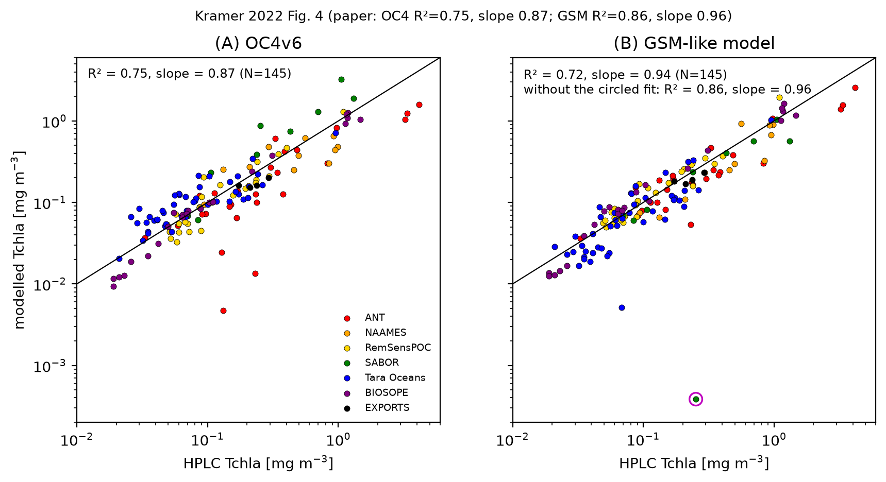

*Kramer Fig. 4: (A) OC4v6, (B) the GSM-like fit. The circled point is the
degenerate SABOR fit discussed above.*

Two further features matter for downstream use:
- Five ANT (Polarstern) spectra are fitted with **b_bp(443) < 0**. The MATLAB
  fit is unbounded, so we keep this faithfully. A positivity-bounded fit
  moves those five to b_bp ≈ 0 and Tchla 0.4–3, and lowers the Fig. 4 R²
  to 0.66. It changes no other spectrum: δRrs differs by 6×10⁻⁸ relative
  RMS elsewhere.
- Per-campaign log₁₀(GSM/HPLC) biases range from −0.16 (Tara Med, NAAMES)
  to +0.04 (RemSensPOC), with SABOR the noisiest (SD 0.9, driven by
  index 69).

**Fig. 2B–C is reproduced** qualitatively. The modelled spectra track the
measured ones. The residuals have the paper's range, about ±3×10⁻⁴ sr⁻¹
with a larger excursion near 400 nm. They also show its features: the
black EXPORTS dip near 430 nm, the structure at 450–520 nm, and the ANT
bump near 680 nm, which is chlorophyll fluorescence the model lacks.

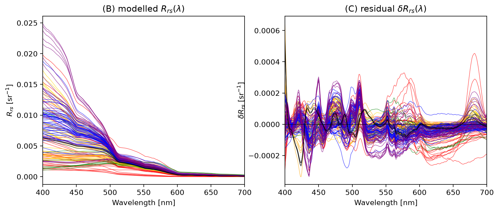

**Cross-checks and sensitivities of δRrs.** All are relative RMS over every
sample and band, against an RMS δRrs of ≈7×10⁻⁵ sr⁻¹:

| Change | Effect on δRrs | Comment |
|---|---|---|
| Python port, with the port's η convention | 4×10⁻⁵ (max 4.5×10⁻⁸ sr⁻¹) | agreement to below the deposit's rounding (2.9×10⁻⁷); b_sw identical to 8×10⁻¹⁶ |
| η from Rrs (port) vs rrs (MATLAB) | 8×10⁻⁴ (max 7×10⁻⁷) | negligible |
| WOA23 monthly vs in-situ T/S (Q&A #22) | 1.2×10⁻³ (max 1.2×10⁻⁶) | negligible. In-situ − WOA: T = +0.7 ± 1.4 °C, S = 0.0 ± 0.4. Tchla changes ≤0.4% except the degenerate SABOR fit (15%) |
| Bounded optimizer | 0.58 | entirely the five negative-b_bp ANT spectra |
| A second 5 nm moving mean | 0.04 (max 3×10⁻⁵) | 10–100× the T/S or η effects. Re-smoothing would be a real error, and it grows under differentiation (§4.2) |

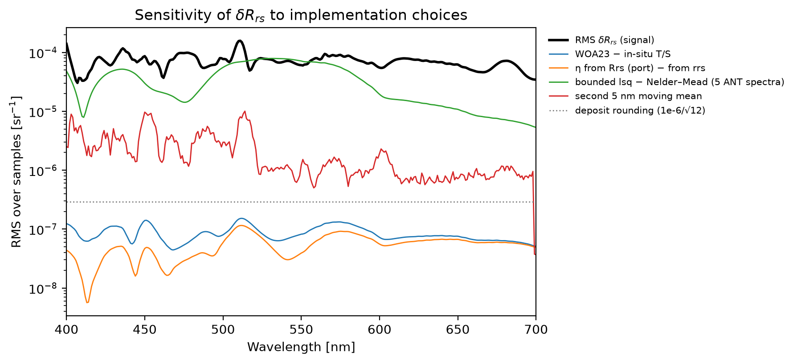

*Per-wavelength RMS of each perturbation compared with the RMS of δRrs. The
WOA, η and port differences sit at or below the deposit's rounding level.*

The WOA comparison uses WOA23, since WOA13 is no longer served: the ¼°
monthly objectively analysed surface fields at each sample's month and
nearest ocean cell (`scripts/sdp/fetch_woa_ts.py`; values in
`$OS_COLOR/PANGAEA/Kramer2022/woa23_surface_ts.csv`). The largest T
difference, +8.8 °C, is a RemSensPOC sample at 55°N, 49°W in August (in-situ
19.0 °C vs WOA 10.2 °C). That in-situ value looks suspect but has no effect
on δRrs.

**Open for §4.2:** keep the degenerate SABOR spectrum (faithful to our run)
or drop it (probably faithful to the paper's). Both will be reported.
### 4.2 The PCR pigment model

**Implementation.** `epft_up/sdp/models.py::train_pcr_kramer` re-implements
`rrsModelTrain.m` from its source, with Kramer's settings from
`Kramer_Rrs_pigments.m`:

- Predictors are `diff(δRrs, 2)`: plain second differences on the 1 nm
  grid, 299 bands at 401–699 nm.
- 100 permutations of a random 75/25 split.
- Inside each permutation, a 5-fold CV chooses the number of PCs
  (≤ 30, by validation MAE).
- Fold coefficients are averaged and back-transformed to A_m(λ) and C_m.
- Outputs are clipped at ≥ 0.

Two quirks of the original are kept deliberately:
- Each inner validation fold is z-scored with **its own** mean and SD.
- The fold coefficients are averaged in standardized units before the
  conversion to raw units.

Within a fold the PC scores are orthogonal and centred, so the OLS
coefficients of the first l PCs do not depend on l. All 30 candidate models
therefore come from one fit; a unit test checks this against explicit
refits. The script is `scripts/sdp/reproduce_pcr.py`; the numbers are in
`reports/figures/sdp/pcr_summary.json` and `kramer_table2.csv`, and the
model ensembles are in `$OS_COLOR/PANGAEA/Kramer2022/products/pcr_rrsD2_1nm.npz`.
MATLAB's random splits cannot be reproduced across languages, so agreement
is statistical (seed 1).

**What Table 2's "normalized MAD" is.** It is the validation MAE divided by
the mean *modelled* value of the validation set: Tchla 0.507 here vs 0.498
in the paper. Dividing by the mean observed value instead gives 0.516 for
Tchla and 1.03 for Fuco (paper 0.84), so that is not it.

**Table 2 is reproduced.** Every pigment's mean R² is within one quoted SD
of the paper's. The table uses all 145 spectra; the 144-spectrum run
(without the degenerate SABOR GSM fit of §4.1) differs by ≤ 0.03 in R².

| Pigment | R² here | R² paper | Δ / SD_paper | MADn here | MADn paper | median #PCs |
|---|---|---|---|---|---|---|
| Tchla | 0.73 ± 0.13 | 0.72 ± 0.15 | +0.1 | 0.51 ± 0.15 | 0.50 ± 0.13 | 22 |
| Chlc12 | 0.67 ± 0.13 | 0.70 ± 0.13 | −0.2 | 0.71 | 0.70 | 20 |
| Chlc3 | 0.62 ± 0.12 | 0.68 ± 0.13 | −0.4 | 0.70 | 0.64 | 17 |
| Fuco | 0.63 ± 0.13 | 0.65 ± 0.15 | −0.2 | 0.85 | 0.84 | 18 |
| ButFuco | 0.51 ± 0.15 | 0.62 ± 0.16 | −0.7 | 0.64 | 0.59 | 13 |
| DVchla | 0.49 ± 0.13 | 0.55 ± 0.12 | −0.5 | 0.64 | 0.59 | 25 |
| HexFuco | 0.48 ± 0.13 | 0.54 ± 0.16 | −0.4 | 0.73 | 0.69 | 13 |
| Perid | 0.55 ± 0.12 | 0.49 ± 0.13 | +0.4 | 0.74 | 0.78 | 18 |
| MVchlb | 0.41 ± 0.16 | 0.42 ± 0.19 | −0.1 | 0.98 | 0.98 | 14 |
| Neo | 0.40 ± 0.16 | 0.42 ± 0.21 | −0.1 | 1.11 | 1.13 | 15 |
| Allo | 0.38 ± 0.15 | 0.40 ± 0.19 | −0.1 | 1.28 | 1.22 | 12 |
| Viola | 0.35 ± 0.17 | 0.38 ± 0.18 | −0.2 | 1.14 | 1.10 | 13 |
| Zea | 0.37 ± 0.11 | 0.37 ± 0.10 | 0.0 | 0.50 | 0.47 | 21 |

The ±σ is the spread over the 100 validation splits. The Monte-Carlo error
of each mean is ≈ σ/10 ≈ 0.015. Our R² is slightly lower on average (mean
Δ ≈ −0.2 SD), most for ButFuco and DVchla, but nowhere outside the quoted
spread.

**Kramer's own trained coefficients reproduce on our δRrs''.** The Python
port ships `original_a_coefs.xlsx` / `original_c_coefs.xlsx`: 100 trained
models per pigment on the same 401–699 nm grid. Applied to *our* δRrs'',
with no retraining, they give full-reconstruction R² within ±0.05 of our own
models for every pigment (Tchla 0.79 vs 0.82, Fuco 0.79 vs 0.80, Chlc12 0.81
vs 0.80). The median coefficient spectra correlate at r = 0.85–0.90 for 10
of 13 pigments, and 0.78 for Perid. Zea and DVchla correlate at only ≈0.5,
yet still predict as well: these pigments' coefficients are poorly
constrained, so many weight spectra fit equally well. Median intercepts
agree to within ≈0.01–0.06 mg m⁻³. This is an independent confirmation that
our δRrs and PCR are Kramer's, not just statistically similar.

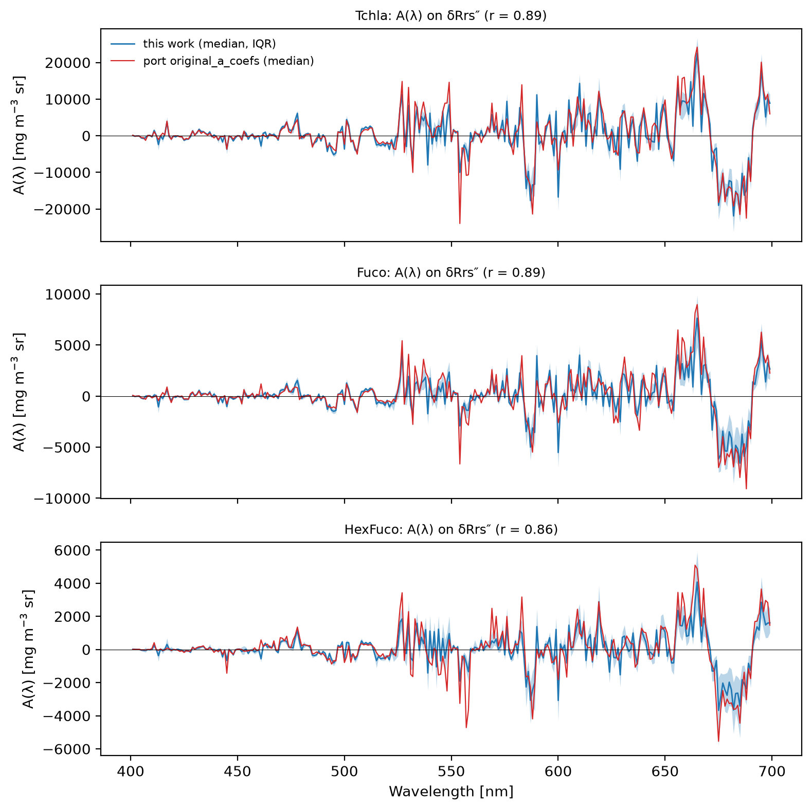

*Median and interquartile range of our 100 A(λ) for Tchla, Fuco and HexFuco,
compared with the median of Kramer's original coefficients. Note that the
largest weights sit at 520–700 nm, where δRrs'' is smallest. That is a
consequence of z-scoring each band before the PCA (taken up in §5).*

**Fig. 6 (median of the 100 models applied to every spectrum).** The
paper's panels are in **log₁₀** space, so samples that are zero on either
axis drop out. Modelled values below the detection limit are set to zero,
as in the paper. The deposit has no method LODs, so I use a proxy:
- for pigments with below-LOD zeros, the smallest non-zero deposited value
  (0.001–0.004 mg m⁻³);
- for Tchla, Zea and Chlc12, which are never below LOD here, the 0.001
  reporting resolution.

| Pigment | here (N=144): slope, intercept, R² (N in plot) | paper: slope, intercept, R² |
|---|---|---|
| Tchla | 0.88, −0.02, 0.71 (127) | 0.94, −0.004, 0.73 |
| Fuco | 0.65, −0.20, 0.71 (89) | 0.80, −0.08, 0.60 |
| Perid | 0.55, −0.83, 0.60 (56) | 0.78, −0.46, 0.51 |
| HexFuco | 0.69, −0.27, 0.64 (125) | 0.76, −0.20, 0.64 |
| MVchlb | 0.62, −0.39, 0.63 (78) | 0.74, −0.26, 0.51 |
| Zea | 0.51, −0.63, 0.50 (144) | 0.53, −0.59, 0.55 |

R² agrees, but **our slopes are lower by 0.02–0.23.** This is not our
training: Kramer's original coefficients on our δRrs'' give the same low
slopes (Tchla 0.84, Fuco 0.61, HexFuco 0.72). Nor is it the regression
convention: ordinary y-on-x, reduced major axis and inverted x-on-y each
fail to match all six panels. One visible difference is that 17 low-Tchla
samples have a modelled Tchla ≤ 0 (the linear model goes negative) and drop
out of the log plot. The paper's panel A seems to keep more low points. With
no quoted uncertainty for Fig. 6, I record this as an **open discrepancy**.
It does not affect Table 2, which agrees.

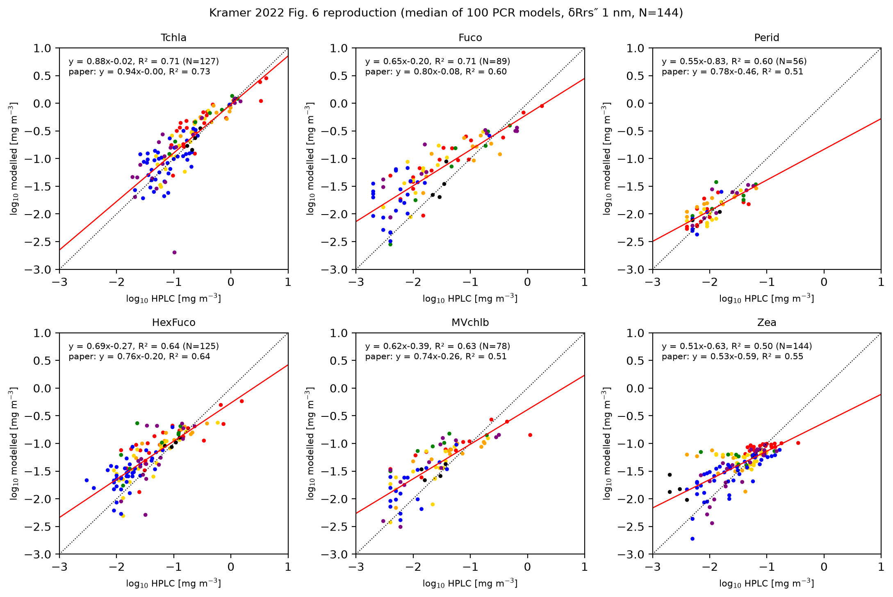

**Fig. 3 (clustering of the 12 accessory-pigment:Tchla ratios; Ward linkage
on 1 − R).** The *measured* dendrogram (cut at 0.65) recovers exactly the
paper's five groups:
- haptophytes {HexFuco, ButFuco};
- green algae {Allo, MVchlb, Neo, Viola};
- diatoms {Fuco, Chlc12, Chlc3};
- dinoflagellates {Perid};
- cyanobacteria {Zea, DVchla}.

The *modelled* dendrogram (cut at 0.80) is fragile:
- The green-algal and diatom groups survive.
- With the detection-limit handling above, {HexFuco, Perid, Zea, DVchla}
  merge and ButFuco stands alone.
- With a coarser proxy (Tchla LOD = 0.019, i.e. 17 more zeroed Tchla
  values), five groups appeared, with Chlc3 moving to Perid.

Modelled ratios exist only where modelled Tchla > 0 (127 of 144 samples), and
clipped zeros dominate the low-concentration ratios. The paper's statement
that "the same five groups emerge" from the modelled pigments therefore
holds only loosely, and it depends on how zeros are handled.

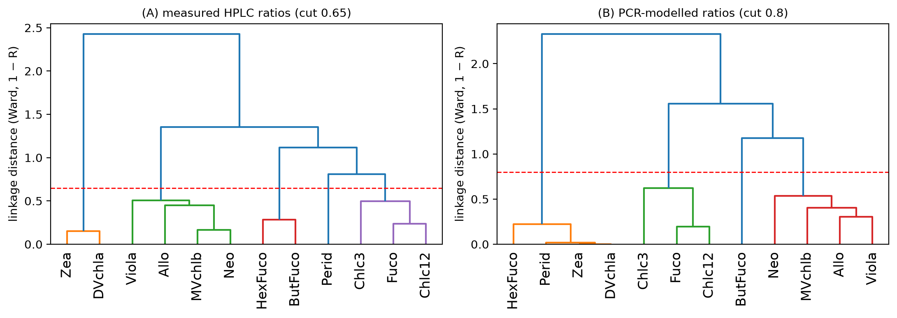

**Supplementary variants** (mean R² over 100 splits, N = 144):

| Pigment | δRrs'' 1 nm (paper) | Rrs' + Rrs'' 1 nm | δRrs'' 5 nm | δRrs'' 10 nm |
|---|---|---|---|---|
| Tchla | 0.73 | 0.76 | 0.72 | 0.71 |
| Fuco | 0.63 | 0.72 | 0.67 | 0.71 |
| HexFuco | 0.50 | 0.59 | 0.62 | 0.62 |
| ButFuco | 0.53 | 0.61 | 0.64 | 0.63 |
| Chlc12 | 0.66 | 0.75 | 0.69 | 0.71 |
| Chlc3 | 0.64 | 0.71 | 0.70 | 0.70 |
| DVchla | 0.46 | 0.54 | 0.54 | 0.54 |
| Perid | 0.55 | 0.54 | 0.52 | 0.45 |
| Zea | 0.36 | 0.36 | 0.43 | 0.42 |
| MVchlb | 0.42 | 0.43 | 0.47 | 0.50 |
| Neo | 0.42 | 0.43 | 0.48 | 0.55 |
| Allo | 0.39 | 0.43 | 0.47 | 0.47 |
| Viola | 0.37 | 0.39 | 0.45 | 0.50 |

Two results:
- **Rrs' + Rrs'' of the *measured* reflectance (no GSM residual) does as
  well as or better than δRrs''** for 11 of 13 pigments. That is consistent
  with the paper's "comparable results", and it is the first hint that the
  residual step adds little; §6.3 tests this properly.
- **Coarser sampling does not hurt here.** Here, "5 nm" and "10 nm" mean
  every 5th or 10th band of the already-smoothed δRrs, then `diff(·, 2)`.
  At 5 nm, skill is flat or higher, in line with the paper. At 10 nm,
  skill is *not* "notably worse" as the paper reports: only Perid drops,
  0.55 → 0.45. The paper does not say how it degraded the resolution (the
  supplement tables S2–S3 are not available to us), so this may be a recipe
  difference. With 29 rather than 299 predictors, the PCR has far fewer
  noisy dimensions to fit, which helps the weaker pigments. Either way, the
  claim that hyperspectral 1 nm resolution is needed is not supported by
  this dataset under this recipe. §5 treats the effective degrees of
  freedom.

## 5. Maths and statistics

The code is in `epft_up/sdp/theory.py` (operators, priors, information
content, filter factors) and `epft_up/sdp/noise.py` (noise models). The
script is `scripts/sdp/maths_section.py`, and the numbers are in
`reports/figures/sdp/maths_summary.json`. Notation: $x\in\mathbb{R}^{301}$
is a δRrs spectrum on the 1 nm grid. $D\in\mathbb{R}^{299\times301}$ is
Kramer's second difference, $(Dx)_i = x_{i+1}-2x_i+x_{i-1}$. $M$ is the
5 nm moving mean. $S=\mathrm{diag}(s)$ holds the per-band standard
deviations used for z-scoring.

### 5.1 The derivative is a fixed linear operator, so it adds no information to a linear model

Every model in Kramer 2022 is linear in its predictors:
$\hat p = A^\top(Dx) + C$. Rearranging,

$$\hat p \;=\; A^\top D x + C \;=\; (D^\top A)^\top x + C \;\equiv\; w_{\rm eff}^\top x + C .$$

So a PCR on δRrs'' *is* a linear model on δRrs, with **effective weight
spectrum** $w_{\rm eff}=D^\top A$. Numerically the identity holds to
machine precision (max difference 10⁻¹⁴). Two consequences follow
immediately:

- $D$ annihilates constants and straight lines, so $w_{\rm eff}$ sums to
  zero and has zero first moment. The model is exactly blind to additive
  offsets and linear tilts of δRrs. That is the one thing differentiation
  buys: invariance to broad baseline errors.
- Any predictive content of δRrs'' is predictive content of δRrs. The
  derivative cannot create information. It can only change *which* weight
  spectrum the estimator ends up with.

**The same data give completely different weight spectra.** PCR on δRrs''
and PCR on δRrs (same settings) produce effective weights that are
essentially uncorrelated: r = 0.003 for Tchla, 0.001 for Fuco and 0.002 for
HexFuco.
- **99.7–99.8%** of the power of $w_{\rm eff}$ lies at spectral frequencies
  ≥ 0.1 cycles nm⁻¹, i.e. periods shorter than 10 nm.
- For PCR on δRrs it is **0.6–1.3%**.

Within random splits the two predict comparably; PCR on δRrs is slightly
better (R² 0.74 vs 0.73 for Tchla, 0.68 vs 0.63 for Fuco, 0.63 vs 0.48 for
HexFuco). The derivative-based weights are rough, bandwise-alternating
patterns (see the figure). Physically, phytoplankton absorption features
are ≳ 10–30 nm wide.

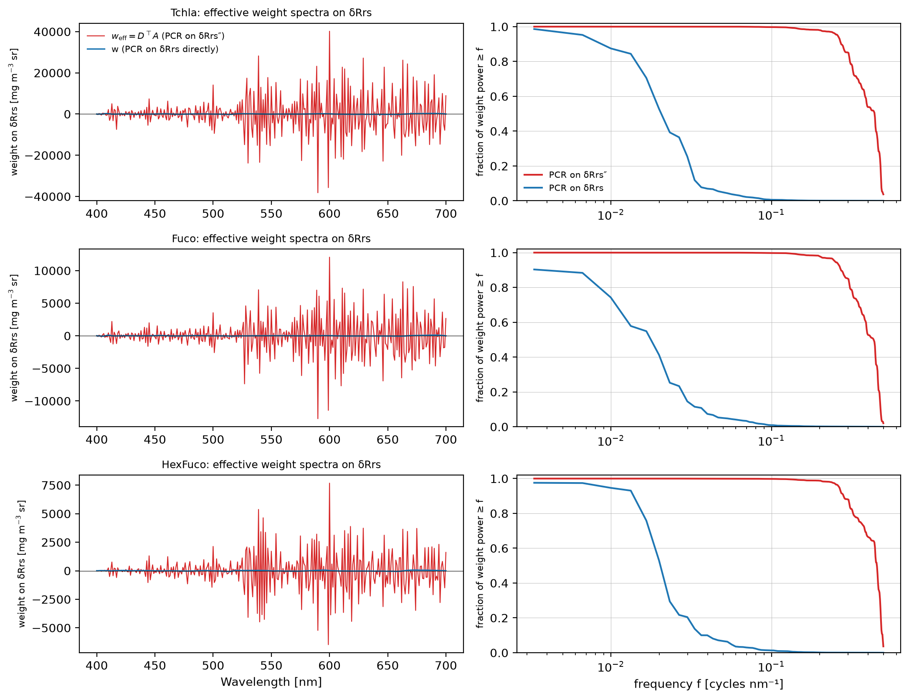

*Left: effective weight spectra on δRrs from PCR on δRrs'' (red,
$D^\top A$) and from PCR on δRrs (blue), median over 100 models. Right: the
fraction of each weight spectrum's power at frequencies ≥ f.*

**The prior the recipe implies.** PCR, ridge and their Bayesian cousins are
shrinkage estimators. In their simplest reading, they put an isotropic prior
on the coefficients of the z-scored predictors, $\beta\sim N(0,\tau^2 I)$
with $Z=S^{-1}Dx$. That makes $w_{\rm eff}=D^\top S^{-1}\beta$ Gaussian with
covariance

$$\mathrm{Cov}(w_{\rm eff}) \;=\; \tau^2\, D^\top S^{-2} D .$$

Three properties follow:
- **Null space:** zero prior weight on constants and lines (as above).
- **Roughness:** with $S$ roughly constant, $D^\top D$ is the fourth-difference
  operator, with eigenvalues $(2\sin\pi f)^4$. The prior therefore puts more
  variance on *rapidly alternating* weight patterns. Drawing from it gives
  **≈5300×** more prior power at f ≥ 0.3 cycles nm⁻¹ than at f < 0.05. For
  z-scoring δRrs directly the ratio is ≈1 (white).
  - This is an **anti-smoothness prior**, the opposite of the physical
    expectation for absorption features. PC truncation does not remove it:
    the retained PCs of $Z$ are themselves dominated by high-frequency
    structure.
- **Red emphasis:** z-scoring divides by the across-sample SD of δRrs'',
  which is tiny in the red. The prior variance of $w_{\rm eff}$ is 7.4×
  larger at 660–700 nm than at 410–460 nm (1.5× without the derivative).
  That is why the largest PCR weights sit at 520–700 nm (§4.2), exactly
  where, below, δRrs'' is closest to its noise floor.

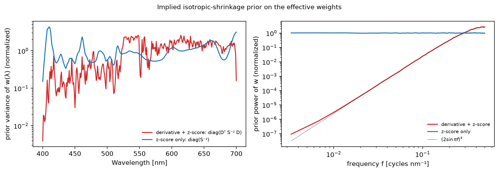

*Left: prior variance of $w(\lambda)$ implied by derivative + z-score + isotropic
shrinkage (red) vs z-score only (blue). Right: the prior's power spectrum;
the dotted line is $(2\sin\pi f)^4$.*

So "δRrs'' + z-score + PCR" is one particular, hand-picked prior on the
weight spectrum. It makes the model offset-invariant, but it rewards rough,
noise-like weights. §6.3's finding that every derivative space transfers
worst between campaigns is what this prior predicts. The natural replacement
(§7) keeps the offset/tilt invariance, if wanted, but uses a smoothness
prior on $w$ and noise-whitened predictors.

### 5.2 Noise propagation and information content

**Noise models.** These are per band, on the 1 nm grid, as they reach the
predictors.
- **Deposit rounding:** the 10⁻⁶ sr⁻¹ steps of PANGAEA 937536 (§3.4),
  white, σ = 2.9×10⁻⁷ sr⁻¹.
- **In-situ-like `pct:0.02` + floor:** IOPtics' model,
  σ = 0.02·max(|Rrs|, median|Rrs|), defined per 5 nm and passed through the
  paper's 5 nm mean.
- **PACE white:** ocpy's OCI per-band Rrs σ (from one early L2 granule; 5.7×10⁻⁴
  sr⁻¹ at 400 nm falling to 6×10⁻⁵ at 700 nm). It is rescaled from the file's
  ≈2 nm sampling to 1 nm bands and passed through the 5 nm mean.
- **PACE correlated:** the same σ, but spectrally smooth (Gaussian
  correlation, ℓ = 30 nm, like an atmospheric-correction error), plus a white
  component of 10% of σ.

Instrument noise is passed through $M$ because Kramer's recipe (and the
port's PACE code) smooths every spectrum before forming δRrs. The deposit's
rounding comes after smoothing. Noise in δRrs is taken as the noise in Rrs:
the GSM fit removes only a 3-parameter smooth projection.

**Amplification.** For white noise of variance σ² per band, $D$ gives
variance 6σ² (coefficients 1, −2, 1), while the across-sample *signal*
of δRrs'' is far smaller than that of δRrs. Per band, the SNR (signal SD
across samples over noise SD; median over bands) is:

| Noise model | δRrs | δRrs'' (1 nm) |
|---|---|---|
| deposit rounding | 200 | **2.0** |
| `pct:0.02` + floor | 1.3 | 0.04 |
| PACE white | 0.5 | 0.02 |
| PACE correlated + 10% white | 0.3 | 0.17 |

Even the deposit's own rounding brings δRrs'' down to SNR ≈ 1–2 longward of
≈525 nm. That is where z-scoring puts the largest weights (§5.1). Smooth
(correlated) noise is the one case where differentiation helps, raising the
relative SNR by suppressing the broad error. Even then δRrs'' remains below
SNR 1 in every band.

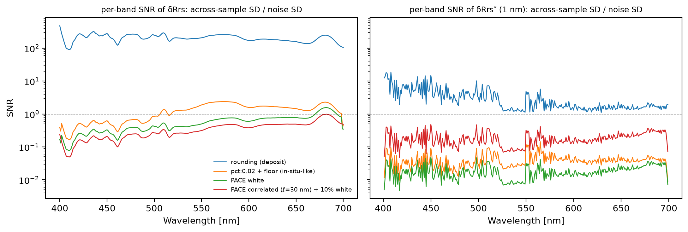

**Degrees of freedom for signal.** A per-band SNR overstates what is lost,
because bands are correlated. The right measure is Rodgers' (2000)

$$d_s = \mathrm{tr}\!\left[C_s\,(C_s+C_n)^{-1}\right] = \sum_i \frac{\lambda_i}{1+\lambda_i},$$

where $\lambda_i$ are the signal-to-noise eigenvalues. Here $C_s$ is the
across-sample covariance of δRrs (145 spectra), $C_n$ the noise covariance,
and for δRrs'' both are propagated through $D$. $d_s$ is invariant under any
invertible linear transform and can only fall under a non-invertible one
such as $D$. Coarser sampling interpolates the deposit to 2.5, 5 and 10 nm
before differencing.

| Noise model | 1 nm | 2.5 nm | 5 nm | 10 nm |
|---|---|---|---|---|
| deposit rounding: δRrs / δRrs'' | 117.8 / 116.9 | 92.6 / 91.1 | 59.3 / 57.3 | 30.8 / 28.8 |
| `pct:0.02` + floor | 10.4 / 9.9 | 8.6 / 8.1 | 7.5 / 6.9 | 6.1 / 5.5 |
| PACE white | 6.0 / 5.4 | 5.3 / 4.7 | 4.5 / 3.8 | 3.5 / 2.8 |
| PACE correlated + 10% white | 24.4 / 23.6 | 15.5 / 15.0 | 11.3 / 11.2 | 8.2 / 8.0 |

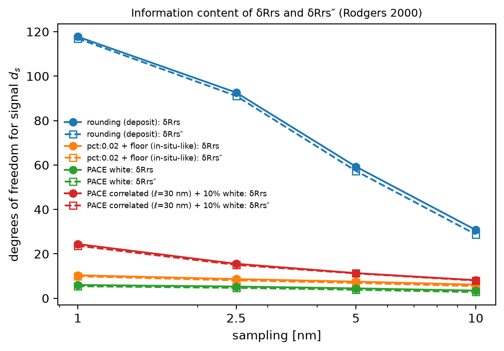

Four results:
1. **Differentiating loses information; it never gains it.** In every case
   $d_s$(δRrs'') is 0.1–2 below $d_s$(δRrs): the offset and tilt
   directions that $D$ removes. Whatever δRrs'' does better or worse in
   practice is the estimator and its prior (§5.1, §5.3), not information.
2. **At realistic noise, a δRrs spectrum carries only ~5–25 independent
   pieces of information,** not 300. In-situ-like 2% noise gives ≈ 10 at
   1 nm; PACE white noise ≈ 5–6; smooth PACE-like errors ≈ 24. With 13
   pigments, about five pigment groups (Kramer & Siegel 2019), and Tchla
   taking at least one dimension, a PACE-quality spectrum leaves very few
   degrees of freedom for composition. The ~118 at deposit-level noise is a
   ceiling set by the 145 samples and by the deposit's very low (smoothed,
   rounded) noise. It is not what a satellite delivers.
3. **Resolution matters less than noise.** Going from 1 to 5 nm costs ≈ 25%
   of $d_s$ under in-situ-like noise (10.4 → 7.5) and PACE white noise
   (6.0 → 4.5), and about half under smooth errors (24 → 11). Going to
   10 nm costs a further ≈ 20–30%. This agrees with §4.2 (no loss at 5 nm),
   and it is a quantitative version of Kramer's "≤ 5 nm is fine" and of
   Cael et al. (2020): neighbouring hyperspectral bands are highly redundant.
4. **The deposit's effective noise is far below 2%.** The PCR works on the
   deposit (Table 2), yet under 2% white noise its δRrs''-based predictions
   would be swamped (next table). So the deposited spectra must carry much
   less band-to-band noise. That is consistent with §3.4, where power at
   the boxcar sidelobe (0.25–0.30 cycles nm⁻¹) is only 3–4× the rounding
   floor. Roughly, that implies pre-smoothing white noise of ~2×10⁻⁶ sr⁻¹
   per nm, ≈ 0.1% of blue Rrs.

**Noise in the predictions.** These are the SD of the PCR prediction due to
Rrs noise, $\sqrt{w_{\rm eff}^\top C_n w_{\rm eff}}$, relative to the
pigment's SD across the dataset, with median weights over 100 models:

| Noise model | Tchla: δRrs'' / δRrs | Fuco: δRrs'' / δRrs | HexFuco: δRrs'' / δRrs |
|---|---|---|---|
| deposit rounding | 0.08 / 0.001 | 0.07 / 0.001 | 0.05 / 0.001 |
| `pct:0.02` + floor | 4.7 / 0.40 | 4.0 / 0.36 | 2.9 / 0.30 |
| PACE white | **11.6** / 0.83 | 9.5 / 0.72 | 7.3 / 0.65 |
| PACE correlated + 10% white | 1.5 / 1.2 | 3.1 / 1.0 | 1.5 / 1.4 |

- Under band-independent noise, the δRrs''-trained weights amplify noise
  **10–15× more** than weights learned on δRrs, and so does any model with
  rough weights.
- At PACE's white-noise level, a single-spectrum SDP Tchla would have a
  noise SD of order 10× the natural range of Tchla. That is unusable without
  heavy spatio-temporal averaging, as Kramer 2022 §4.1 anticipated.
- Even the deposit's rounding alone contributes 5–8% of each pigment's SD to
  δRrs''-based predictions.
- Under smooth (AC-like) errors the two are comparable. Neither is good
  unless the smooth error is much smaller than ocpy's σ.
- The pragmatic reading: the true OCI error is a mixture. SDP-style weights
  are only safe if the band-to-band (white) part of the PACE uncertainty is
  ≲ 1% of the σ used here.

### 5.3 PCR, ridge and PLS as spectral filters

Write $Z = U\Sigma V^\top$ (z-scored δRrs'', centred). Every linear
estimator in the row space of $Z$ is

$$\hat\beta = \sum_i f_i\,\frac{u_i^\top y}{\sigma_i}\,v_i ,$$

with **filter factors** $f_i$ (Hansen 1998; Frank & Friedman 1993):
- PCR: $f_i=1$ for $i\le k$, 0 otherwise (a sharp cut);
- ridge: $f_i=\sigma_i^2/(\sigma_i^2+\lambda)$ (a smooth roll-off);
- PLS: Krylov-polynomial factors that oscillate and can exceed 1.

On the full dataset, for Tchla and Fuco:

| | PCR (k from §4.2) | ridge (λ by 5-fold CV) | PLS (comps by 5-fold CV) |
|---|---|---|---|
| Tchla: effective dof Σfᵢ | 22 | 68 (λ = 84) | 54 (5 comps; max fᵢ = 1.17) |
| Fuco: effective dof Σfᵢ | 18 | 103 (λ = 20) | 74 (6 comps; max fᵢ = 1.55) |
| corr(β, β_PCR): Tchla / Fuco | — | 0.74 / 0.55 | 0.90 / 0.75 |

The top-k PCs retain 73–76% of the variance of $Z$.

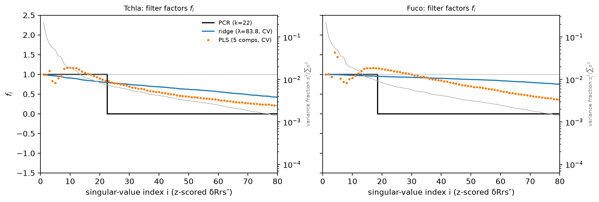

*Filter factors of PCR, ridge and PLS on z-scored δRrs'' for Tchla and Fuco.
The grey line (right axis) is each component's fraction of the variance.*

Interpretation:
- **The three estimators are different spectral filters on the same
  basis.**
  - PCR keeps ≈ 20 components outright.
  - Ridge shrinks every component, leaking weight into the many
    low-variance, high-frequency components (effective dof 68–103).
  - PLS behaves like PCR at the top of the spectrum, but over-weights some
    mid-index components ($f_i>1$).
- **All three share the basis $Z=S^{-1}Dx$, and with it the anti-smoothness
  prior of §5.1.** The PCR-vs-ridge/PLS choice moves the cut-off but not the
  basis. Swapping estimators therefore cannot be expected to fix the
  cross-campaign transfer (§6.2–6.3); changing the basis and the prior can.
  §7 tests this directly. There, ridge and PLS on δRrs'' serve as controls,
  and the candidates are a smoothness-penalized, noise-whitened low-rank
  weighting on δRrs (or M1/M3) and its Bayesian version, all scored with the
  standard Benchmark.

**Summary of §5.**
1. The second derivative is a fixed linear map, so it carries no new
   information; it removes only the offset and tilt.
2. Combined with z-scoring and isotropic shrinkage, it imposes a prior that
   favours rough, noise-like weight spectra.
3. Under any band-independent noise, that prior amplifies noise 10× or more
   relative to models fitted on δRrs itself.
4. At realistic noise levels a spectrum carries ~5–25 independent pieces of
   information, and 5 nm sampling keeps most of them.

## 6. Diagnostics — *Execution #4, #5*

The code is in `epft_up/sdp/validate.py` and `scripts/sdp/diagnostics_null_loco.py`.
The numbers are in `reports/figures/sdp/diag_summary.json` and
`diag_skill_table.csv`. Everything here uses all 145 spectra, as the paper
does. Dropping the degenerate SABOR fit changes no conclusion; those numbers
are in the JSON.

**Design.** Every model is trained and scored on *identical* splits, so the
comparisons are paired. There are two validation schemes:
- Kramer's 100 random 75/25 splits (the same split sizes; seed 1);
- **leave-one-campaign-out (LOCO)**: each of the 8 campaigns held out in
  turn, with one prediction per sample pooled over the folds.

The models compared:

| Model | Predictor | What it measures |
|---|---|---|
| PCR | δRrs'' (Kramer 2022) | the paper's method |
| null_GSM | log₁₀ P = a + b log₁₀ Tchla_GSM, fitted per split | what a hyperspectral Tchla retrieval alone gives |
| null_OC4 | the same with OC4v6 band-ratio Tchla | what a *multispectral* Tchla gives |
| oracle | the same with HPLC Tchla | the ceiling of Tchla covariance (not achievable) |
| const | training mean | no skill (ratios) |

The two null models have only 2 parameters, fitted on the training split.
Zeros are replaced by ½·LOD wherever a log is taken, through
`validate.replace_zeros`, with the LOD proxy of §4.2.

### 6.1 Skill beyond Tchla

**Absolute concentrations: SDP has no skill beyond Tchla, except for the
cyanobacterial pigments, and that exception disappears out of campaign.**
R² below is Table 2's linear-space statistic. "PCR > null_GSM" is the
fraction of the 100 paired splits in which PCR has the higher R².

| Pigment | PCR | null_GSM | null_OC4 | oracle | PCR > null_GSM |
|---|---|---|---|---|---|
| Tchla | 0.72 | **0.81** | 0.65 | — | 22% |
| Chlc12 | 0.64 | **0.78** | 0.55 | 0.92 | 18% |
| Chlc3 | 0.62 | **0.73** | 0.47 | 0.82 | 31% |
| Fuco | 0.61 | **0.72** | 0.57 | 0.81 | 21% |
| MVchlb | 0.44 | **0.62** | 0.45 | 0.74 | 18% |
| HexFuco | 0.48 | **0.61** | 0.39 | 0.73 | 30% |
| Perid | 0.55 | 0.56 | **0.60** | 0.53 | 55% |
| ButFuco | 0.50 | **0.52** | 0.34 | 0.60 | 53% |
| Neo | 0.43 | **0.52** | 0.40 | 0.66 | 34% |
| Viola | 0.38 | **0.52** | 0.42 | 0.68 | 28% |
| Allo | 0.38 | **0.47** | 0.38 | 0.75 | 33% |
| Zea | **0.37** | 0.20 | 0.08 | 0.21 | 87% |
| DVchla | **0.48** | 0.06 | 0.02 | 0.06 | 100% |

What the table shows:
- A two-parameter power law in the **GSM-retrieved Tchla beats PCR for 11
  of 13 pigments**, Tchla itself included. That GSM Tchla is a by-product of
  the very residual step SDP uses.
- **Even the multispectral OC4 Tchla matches or beats PCR for 6 of 13**
  pigments.
- PCR beats the Tchla nulls only for **DVchla and Zea**, the two pigments
  whose concentration does *not* scale with Tchla (Prochlorococcus and
  Synechococcus dominate the oligotrophic end, so the null R² is ≈0).
- The oracle sits above PCR for every pigment except Perid and Zea. Most of
  the information in the HPLC table is Tchla covariance, and SDP recovers
  less of it than a direct Tchla retrieval does.
- Log-space scoring gives the same picture. There, PCR is further penalized
  by its clipped zeros: Tchla log-R² is 0.43 for PCR vs 0.72 for null_GSM.

**Composition (log₁₀ pigment:Tchla).** The table compares three versions of
the ratio:
- PCR trained directly on the log ratio;
- the ratio of PCR's *absolute* predictions ("derived"), which is what a
  user of SDP pigment products would compute;
- the better of the two Tchla nulls (a ratio-on-Tchla power law).

| Ratio | random: PCR_log | derived | best null | PCR > null | LOCO: PCR_log | best null | ΔR² 95% CI |
|---|---|---|---|---|---|---|---|
| DVchla:Tchla | 0.69 | 0.29 | 0.42 | 100% | 0.36 | 0.32 | [−0.05, 0.12] |
| Fuco:Tchla | 0.61 | 0.03 | 0.38 | 100% | 0.40 | 0.31 | [−0.01, 0.17] |
| Zea:Tchla | 0.57 | 0.22 | 0.42 | 90% | 0.34 | 0.35 | [−0.10, 0.09] |
| Chlc3:Tchla | 0.55 | 0.03 | 0.34 | 98% | 0.17 | 0.20 | [−0.14, 0.07] |
| Chlc12:Tchla | 0.44 | 0.03 | 0.34 | 94% | 0.28 | 0.27 | [−0.05, 0.08] |
| Neo:Tchla | 0.38 | 0.09 | 0.20 | 91% | 0.20 | 0.04 | [0.02, 0.28]* |
| Allo:Tchla | 0.31 | 0.02 | 0.05 | 99% | 0.08 | 0.20 | [−0.24, 0.02] |
| Perid:Tchla | 0.29 | 0.08 | 0.19 | 83% | 0.09 | 0.08 | [−0.08, 0.08] |
| MVchlb:Tchla | 0.24 | 0.02 | 0.17 | 74% | 0.03 | 0.04 | [−0.06, 0.03] |
| HexFuco:Tchla | 0.18 | 0.02 | 0.06 | 89% | 0.03 | 0.21 | [−0.30, −0.06] |
| ButFuco:Tchla | 0.18 | 0.02 | 0.06 | 80% | 0.00 | 0.08 | [−0.21, 0.01] |
| Viola:Tchla | 0.17 | 0.02 | 0.04 | 92% | 0.01 | 0.29 | [−0.44, −0.13] |

\* Neo is 74% below detection, and its result is an artifact of the zero
replacement. Under LOCO its PCR log-ratio R² is 0.03, 0.20 and 0.47 for
zeros at 0.1, 0.5 and 1.0 × LOD. The ratios with few zeros are insensitive
to that choice: Fuco 0.39/0.42/0.41, Zea 0.33 throughout, Chlc12 0.28
throughout.

Three conclusions:
1. **The derived ratios are empty.** The pigment ratios implied by SDP's
   absolute products carry essentially no compositional information:
   R² 0.02–0.09, rising to 0.2–0.3 only for Zea and DVchla. SDP's absolute
   pigments are, to first order, Tchla times a constant.
2. **Trained on the ratio itself, the spectra do carry composition in
   random splits.** Fuco:Tchla, Chlc3:Tchla, DVchla:Tchla and Zea:Tchla
   reach R² 0.55–0.69 and beat the nulls in 90–100% of splits. This is
   where δRrs'' has genuine information beyond Tchla.
3. **That information does not transfer between campaigns (§6.2).**

### 6.2 Leakage: random splits vs leave-one-campaign-out

Kramer's random splits put samples from the same cruise in both training and
validation. Holding out a whole campaign shows how much of the skill is
cruise-specific.

**Absolute concentrations, LOCO pooled R²:**

| | Tchla | Fuco | Chlc12 | Chlc3 | HexFuco | MVchlb | Perid | DVchla | Zea |
|---|---|---|---|---|---|---|---|---|---|
| PCR, random | 0.72 | 0.61 | 0.64 | 0.62 | 0.48 | 0.44 | 0.55 | 0.48 | 0.37 |
| **PCR, LOCO** | **0.44** | **0.32** | **0.29** | **0.24** | **0.12** | **0.15** | **0.45** | **0.04** | **0.01** |
| null_GSM, LOCO | 0.66 | 0.56 | 0.54 | 0.58 | 0.39 | 0.37 | 0.48 | 0.21 | 0.02 |
| null_OC4, LOCO | 0.46 | 0.39 | 0.28 | 0.20 | 0.16 | 0.13 | 0.50 | 0.12 | 0.02 |

- PCR loses **roughly half its R²** when a campaign is held out: Tchla 0.72
  → 0.44, HexFuco 0.48 → 0.12. Its advantage on the cyanobacterial
  pigments vanishes: DVchla goes from 0.48 to 0.04.
- The Tchla nulls lose much less (null_GSM Tchla 0.81 → 0.66).
- Under LOCO, PCR is **significantly worse than null_GSM** (the paired
  bootstrap 95% interval of ΔR² lies below 0) for Tchla, HexFuco, Allo,
  DVchla, MVchlb, Chlc12 and Chlc3. It is better for none of the 13
  pigments.

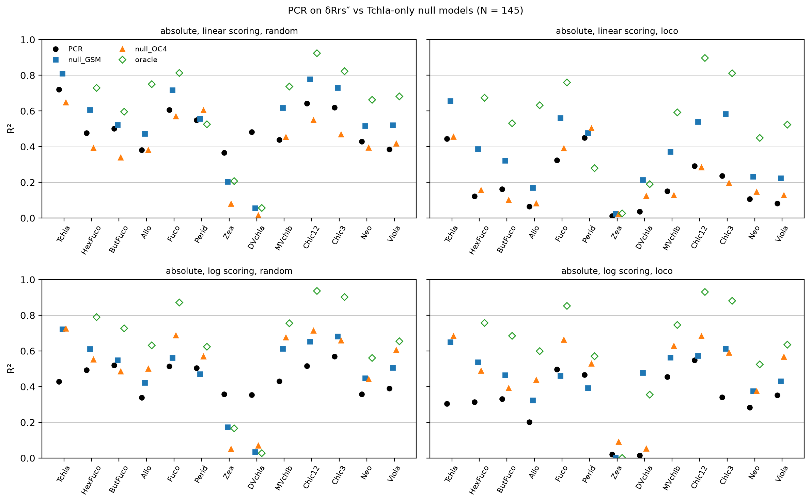

*R² of PCR and the Tchla-only null models for each pigment: random splits
(left) vs LOCO (right), linear (top) vs log (bottom) scoring. The open
diamonds (oracle, HPLC Tchla) show how much of each pigment is explained by
Tchla covariance alone.*

**Composition under LOCO.**
- **No ratio retains significant skill beyond the Tchla nulls** when a
  campaign is held out. Neo appears to, but only through the zero
  replacement (see above).
- The best candidates are **Fuco:Tchla** (0.40 vs 0.31; CI [−0.01, 0.17]),
  then DVchla:Tchla and Zea:Tchla (≈ the null).
- For HexFuco, ButFuco, MVchlb and Viola, PCR's held-out log-ratio RMS error
  is **no better than predicting the training-mean ratio**: 0.28 vs 0.25,
  0.31 vs 0.30, 0.35 vs 0.35, and 0.35 vs 0.33 dex. Only Fuco (0.29 vs
  0.37), Zea (0.44 vs 0.54) and DVchla (0.77 vs 0.98) clearly beat a constant
  ratio out of campaign.

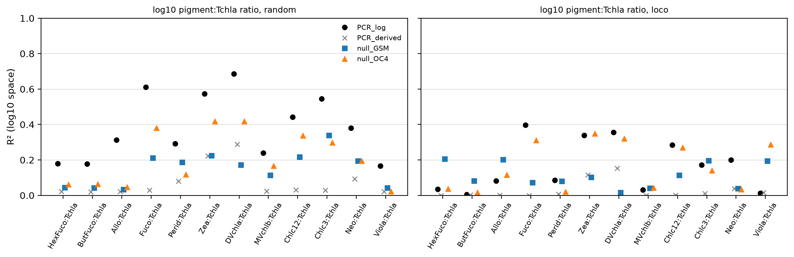

**Why LOCO hurts.** Held-out-campaign predictions are systematically offset
by campaign. When it is held out, BIOSOPE (South Pacific gyre, Tchla ≈ 0.02
mg m⁻³) is predicted at 0.2–0.5 mg m⁻³. Many RemSensPOC and Tara Med
spectra are predicted at ≤ 0. The PCR weights the fine spectral structure
of δRrs'', and part of that structure is specific to the instrument, the
processing or the region of each campaign (§3.4, §4.1): RAMSES for ANT,
HyperPro for the others, and different processing chains. A two-parameter
Tchla model does not see that structure and transfers better.

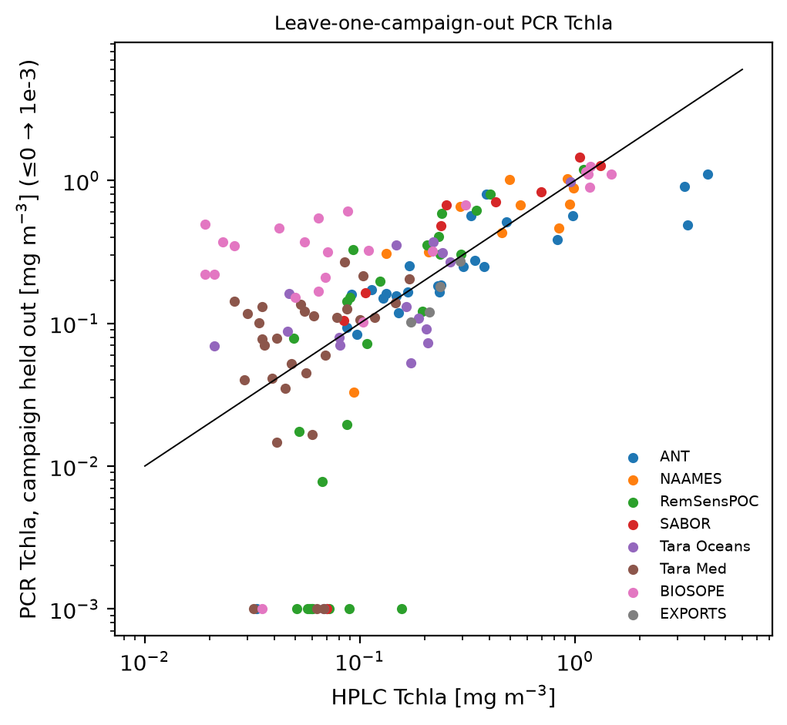

**Bottom line for §6.1–6.2.** On this dataset:
1. SDP's absolute pigment concentrations are matched or beaten by a
   Tchla-only power law, using the GSM Tchla that SDP already computes,
   under both random and campaign-held-out validation.
2. δRrs'' does carry compositional information within campaigns, most
   clearly for Fuco:Tchla and the cyanobacterial ratios.
3. **None of it is demonstrated to transfer to an unseen campaign.** At most
   a weak Fuco:Tchla signal survives (not significant at 95%).

Kramer's Table 2 statistics are real, but they measure mostly Tchla and
within-cruise similarity. The question for §6.3 and §7 is whether a
different predictor space or a regularized, noise-aware weighting can make
the compositional signal transfer.
### 6.3 What the residual buys (source-space comparison)

**Standard scorecard from here on.** `validate.Benchmark` fixes the 25
targets (13 absolute pigments and 12 log₁₀ ratios), the splits (100 random
and LOCO) and the baselines (Tchla nulls; a constant ratio). Every model in
§6.3–§8 is judged on two things together: **skill above the best Tchla null
and skill under LOCO**. Reported per target:
- R²;
- ΔR² vs the best null;
- "beats null, random": the model wins in ≥ 90% of paired splits;
- "beats null, LOCO": the bootstrap 95% CI of ΔR² is above 0.

Running PCR on δRrs'' through the Benchmark reproduces §6.1–6.2 exactly.
The script is `scripts/sdp/source_spaces.py`; the outputs are
`source_spaces_table.csv` (every model × target),
`source_spaces_summary.csv` and `source_spaces_summary.json`.

**Predictor spaces, all with Kramer's PCR, N = 145:**

| Space | What it is |
|---|---|
| Rrs | measured spectra (like Lange et al. 2020's PCR, without SST) |
| Rrs'' | `diff(Rrs, 2)` |
| δRrs | Kramer's residual |
| δRrs'' | the paper's predictor |
| M1 | El Hourany & Kramer (2026) spline residual of rrs (csaps p = 0.0005, penalty rescaled from their 2.5 nm grid to 1 nm) |
| M3 (7/11/21 nm) | El Hourany M3: Savitzky–Golay (order 3) 2nd derivative of rrs. Their window is not given; three tried |
| δRrs ⊕ GSM, δRrs'' ⊕ GSM | plus log₁₀ Tchla_GSM, log₁₀ a_dg(443), b_bp(443) |
| GSM3 | the three GSM parameters alone |
| δRrs''_flat30/80, δRrs_flat80 | GSM refitted with A(λ),B(λ) Gaussian-smoothed (FWHM 30, 80 nm): a featureless a_ph baseline |
| δRrs_awsm, δRrs''_awsm | GSM refitted with a_w, A, B given the same 5 nm moving mean as the deposited Rrs (see below) |

**Summary.** Means over the 13 absolute and 12 ratio targets. The counts
are the number of targets that beat the Tchla null.

| Space | abs R², random | abs R², LOCO | abs beats null (rand / LOCO) | ratio log-R², random | ratio log-R², LOCO | ratio beats null (rand / LOCO) | ratio LOCO RMS < const |
|---|---|---|---|---|---|---|---|
| Rrs | 0.56 | 0.32 | 1 / 1 | 0.42 | 0.22 | 9 / 2 | 8 |
| Rrs'' | 0.49 | 0.20 | 1 / 0 | 0.36 | 0.16 | 7 / 2 | 7 |
| δRrs | 0.60 | 0.38 | 1 / 1 | 0.46 | 0.20 | 10 / 2 | 7 |
| **δRrs'' (paper)** | 0.51 | **0.19** | 1 / 0 | 0.38 | **0.17** | 8 / 1 | 9 |
| M1 | 0.59 | **0.40** | 1 / 0 | 0.46 | 0.26 | 10 / **5** | 10 |
| M3, 7 nm | 0.55 | 0.25 | 1 / 0 | 0.39 | 0.19 | 10 / 2 | 8 |
| M3, 11 nm | 0.56 | 0.31 | 1 / 0 | 0.42 | 0.23 | 11 / 4 | 10 |
| **M3, 21 nm** | 0.59 | 0.37 | 1 / 1 | **0.47** | **0.27** | **12 / 5** | **11** |
| δRrs ⊕ GSM | 0.60 | 0.39 | 1 / 1 | 0.47 | 0.20 | 10 / 1 | 7 |
| δRrs'' ⊕ GSM | 0.52 | 0.20 | 1 / 0 | 0.38 | 0.17 | 8 / 1 | 9 |
| GSM3 | 0.43 | 0.17 | 1 / 0 | 0.25 | 0.17 | 0 / 1 | 8 |
| δRrs''_flat30 | 0.50 | 0.19 | 1 / 0 | 0.39 | 0.17 | 8 / 2 | 9 |
| δRrs''_flat80 | 0.51 | 0.20 | 1 / 0 | 0.38 | 0.16 | 8 / 1 | 9 |
| δRrs_flat80 | 0.59 | **0.40** | 2 / 2 | 0.46 | 0.22 | 9 / 3 | 8 |
| δRrs_awsm | 0.59 | 0.39 | 1 / 2 | 0.46 | 0.20 | 10 / 3 | 7 |
| δRrs''_awsm | 0.52 | 0.21 | 2 / 0 | 0.39 | 0.18 | 8 / 2 | 9 |

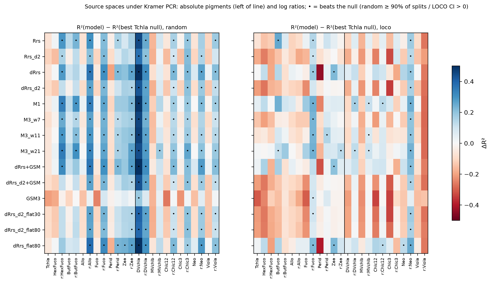

*ΔR² against the best Tchla null for every space (rows) and target
(columns; absolute pigments left of the line, log ratios right), for random
splits (left) and LOCO (right). Dots mark targets that beat the null.*

**Targets that beat the Tchla null under LOCO** (R² vs best-null R²):
- **Fuco:Tchla** beats it with M1 (0.56 vs 0.31), M3 21 nm (0.55),
  δRrs_flat80 (0.53), δRrs (0.50) and raw Rrs (0.46). It does **not** with
  δRrs'' (0.40; CI includes 0).
- **DVchla:Tchla** with M1 (0.49 vs 0.32) and M3 21 nm (0.45).
- **Zea:Tchla** with M3 21 nm (0.48 vs 0.35).
- **Chlc12:Tchla** with M1 and δRrs_flat80 (0.40 vs 0.27).
- MVchlb:Tchla with M1 and M3 21 nm, but at low R² (0.16 vs 0.04).
- Among absolute concentrations: Zea with δRrs (0.25 vs 0.02) and ButFuco
  with raw Rrs and M3 21 nm.
- Neo:Tchla appears for every space but is the zero-replacement artifact of
  §6.1.

No space beats the null on absolute Tchla under LOCO. The best are M1 (0.70)
and δRrs (0.66), against the GSM null's 0.66.

**What this says about the derivative and the residual:**

1. **The second derivative is the harmful step.** Every
   finite-difference space (Rrs'', δRrs'', δRrs'' ⊕ GSM, δRrs''_flat,
   δRrs''_awsm) has the lowest LOCO skill, about 0.19–0.21 absolute and
   0.16–0.18 ratio. The same information without differentiating does about
   twice as well out of campaign: δRrs 0.38, M1 0.40. M3 shows the same
   effect smoothly: widening the Savitzky–Golay window from 7 to 11 to
   21 nm raises LOCO skill monotonically (absolute 0.25 → 0.31 → 0.37;
   ratio 0.19 → 0.23 → 0.27). This is the noise-amplification argument of
   Q&A #11 seen empirically. Differentiation boosts the highest
   frequencies, where the deposit is at its rounding floor (§3.4) and where
   campaign-specific instrument structure lives (§6.2). Within a campaign
   the PCR can exploit those frequencies (random-split skill is only modestly
   lower); across campaigns they do not transfer.
2. **The residual step helps a little, and only without the derivative.**
   δRrs vs raw Rrs: LOCO absolute 0.38 vs 0.32. But δRrs'' (0.19) is no
   better than Rrs'' (0.20). M1, a purely empirical spline residual with no
   bio-optical model, does as well as or better than δRrs, so the
   semi-analytical GSM is not what helps. What helps is removing the
   broad-scale envelope.
3. **The NOMAD a_ph features in the GSM baseline are irrelevant.**
   - Replacing A(λ), B(λ) by 30 or 80 nm-smoothed versions changes δRrs''
     by < 0.5% (r = 0.996–0.997).
   - The GSM Tchla retrieval is unaffected (log-R² 0.72 for every baseline).
   - Every score is unchanged within noise; δRrs_flat80 is in fact
     marginally the best absolute space under LOCO.
   - So δRrs is not a "compositional anomaly relative to a mean NOMAD
     community" (Q&A §C-10): the model's pigment features barely enter it.
     It is, to a good approximation, Rrs minus a smooth, Tchla- and
     IOP-scaled envelope.
4. **A smoothing mismatch artifact in δRrs''.** The deposited Rrs carry the
   5 nm moving mean, but Rrs_mod is built from the 1 nm pure-water
   absorption table without it. The fine structure of a_w, scaled differently
   in every spectrum, therefore enters Rrs_mod''. As a result:
   - The model curvature has **1.30×** the across-sample variance of the
     measured Rrs''.
   - Subtracting it **raises** the variance: var(δRrs'') = 1.52 × var(Rrs'').
   - Smoothing a_w the same way as the data drops the model curvature to
     0.64× and δRrs'' to 0.99× var(Rrs''). The resulting δRrs'' correlates
     only 0.61 with the published one. Smoothing A and B instead changes
     nothing (r = 0.99998).

   This is an inconsistency in the published pipeline. We reproduce it, so
   Kramer's own δRrs'' presumably carries it too. The PCR is fairly
   insensitive to it (LOCO absolute 0.21 vs 0.19 once fixed), because
   z-scoring and PC truncation down-weight it, but it is a genuine artifact.
5. **GSM parameters add nothing linear.** Appending log Tchla_GSM, a_dg(443)
   and b_bp(443) to δRrs changes little (0.39 vs 0.38 absolute LOCO). On
   their own they are weaker than the two-parameter null (abs 0.43 vs ≈0.55
   random), because a linear PCR on log Tchla is the wrong functional form
   for concentration. The null's power law is the right one.

**Implications for §7.** The most promising inputs are spaces that remove the
broad envelope without amplifying high frequencies: δRrs (with consistent
smoothing), M1, or M3 with wide windows. The target should be the log
pigment:Tchla ratio. Fuco:Tchla and the cyanobacterial ratios
(DVchla:Tchla, Zea:Tchla) are the only compositional signals that pass both
tests here. A learned wavelength weighting should explicitly penalize the
high-frequency structure (a smoothness prior and noise whitening), which is
exactly what the derivative + z-score recipe fails to do.

## 7. Alternatives: a learned wavelength weighting

The code is in `epft_up/sdp/weighting.py` and
`scripts/sdp/learned_weighting.py`. The outputs are `weighting_table.csv`
(every model × target), `weighting_summary.csv`, `weighting_ranks.csv` and
`weighting_summary.json`. Everything is scored on the standard Benchmark of
§6.3: 100 random splits plus LOCO, each target against the best Tchla-only
null. The primary target is the log₁₀ pigment:Tchla ratio.

### 7.1 Models

The **shared low-rank weighting W** is a multi-output regression of all
targets of one kind (12 log ratios, or 13 concentrations, standardized) on
δRrs in physical units plus the three GSM parameters (log₁₀ Tchla_GSM,
log₁₀ a_dg(443), b_bp(443)). Each weight spectrum $w$ is penalized by

$$\lambda_n\, w^\top\Sigma_n w \;+\; \lambda_s\,\lVert D_2 w\rVert^2 \;+\; \varepsilon\lVert w\rVert^2 .$$

- The first term is the prediction variance that Rrs noise $\Sigma_n$ would
  inject (§5.2). It is the regression form of noise whitening; $\Sigma_n$ is
  the in-situ-like `pct:0.02` model through the 5 nm mean.
- The second term is a smoothness prior, the opposite of §5.1's implied
  anti-smoothness prior.

The penalized solution is then reduced to rank $r$ along the leading
directions of its fitted values (reduced-rank regression; Izenman 1975). The
$r$ columns of $B_{\rm pen}V_r$ are the shared latent weight spectra.
$(\lambda_n, \lambda_s, r)$ are chosen inside each training set by either:
- random 5-fold CV ("random inner"), or
- **leave-one-campaign-out within the training campaigns ("group
  inner")**, which selects for settings that transfer.

The grid: λₙ ∈ {0, 0.1, 1, 10, 100}, λₛ ∈ {10⁻⁴ … 10³}, r ∈ 1…10.

Controls separate the three ingredients:

| Model | Basis | Estimator | Tests |
|---|---|---|---|
| PCR δRrs'' | z-scored δRrs'' | PCR | the paper |
| ridge / PLS δRrs'' | z-scored δRrs'' | ridge (GCV) / PLS (inner CV) | estimator change only |
| ridge / PLS δRrs ⊕ GSM | z-scored δRrs ⊕ GSM | ridge / PLS | basis change only |
| smooth (per pigment) | δRrs ⊕ GSM | the penalty above, rank 1, group inner | penalty without sharing |
| shared W, random / group | δRrs ⊕ GSM | the penalty above + reduced rank | the full model |
| shared W on M1 | M1 ⊕ GSM | the same, group inner | El Hourany's spline residual as the basis |

### 7.2 Results

Means over the 13 absolute and 12 ratio targets; counts are targets that
beat the best Tchla null:

| Model | abs R², random | abs R², LOCO | abs beats null, LOCO | ratio log-R², random | **ratio log-R², LOCO** | ratio beats null (rand / **LOCO**) | ratio LOCO RMS < const |
|---|---|---|---|---|---|---|---|
| PCR δRrs'' (paper) | 0.51 | 0.19 | 0 | 0.38 | **0.17** | 8 / **1** | 9 |
| ridge δRrs'' | 0.36 | 0.19 | 0 | 0.27 | 0.11 | 1 / 0 | 1 |
| PLS δRrs'' | 0.49 | 0.18 | 0 | 0.38 | 0.17 | 7 / 2 | 8 |
| ridge δRrs ⊕ GSM | 0.54 | 0.29 | 1 | 0.48 | 0.18 | 10 / 2 | 3 |
| PLS δRrs ⊕ GSM | 0.57 | 0.33 | 2 | 0.45 | 0.17 | 10 / 0 | 5 |
| smooth, per pigment (group) | 0.58 | 0.39 | 2 | 0.42 | 0.18 | 9 / 3 | 9 |
| shared W, random inner | 0.58 | 0.39 | 1 | 0.47 | **0.25** | 11 / 4 | 8 |
| **shared W, group inner** | 0.57 | 0.39 | **3** | 0.38 | **0.24** | 7 / **6** | **10** |
| shared W on M1, group inner | 0.55 | **0.40** | 2 | **0.48** | **0.25** | **12** / 4 | **11** |

**Which ratios beat the Tchla null out of campaign** (LOCO R² vs best null R²):

| Ratio | PCR δRrs'' | shared W (group) | shared W on M1 (group) | null |
|---|---|---|---|---|
| Fuco:Tchla | 0.40 | **0.45** | **0.55** | 0.31 |
| Zea:Tchla | 0.34 | **0.48** | **0.51** | 0.35 |
| DVchla:Tchla | 0.36 | **0.47** | **0.46** | 0.32 |
| Chlc12:Tchla | 0.28 | **0.43** | 0.38 | 0.27 |
| Perid:Tchla | 0.09 | **0.20** | 0.08 | 0.08 |
| Allo:Tchla | 0.08 | 0.24 | 0.22 | 0.20 |
| HexFuco, ButFuco, MVchlb, Viola, Chlc3 | ≤ 0.17 | ≤ 0.20 | ≤ 0.19 | — (none beat it) |

Bold marks a significant win (the bootstrap 95% CI of ΔR² is above 0).
Neo:Tchla also "wins" for most models, but that is the zero-replacement
artifact of §6.1 and is excluded. Among absolute concentrations, the shared
W beats the null out of campaign for ButFuco (0.61 vs 0.32), Zea (0.13 vs
0.02) and Neo (0.42 vs 0.23). It never does for Tchla: no linear model on
these spectra beats the two-parameter GSM-Tchla power law for Tchla itself.

What the controls show:
1. **Changing only the estimator does nothing.** Ridge and PLS on δRrs''
   are no better than PCR under LOCO (0.11–0.17 ratio, 0.18–0.19 abs), as
   §5.3 predicted: they share the basis and its prior.
2. **Changing only the basis helps absolute concentrations but not ratios.**
   Ridge/PLS on δRrs ⊕ GSM lift LOCO abs R² from 0.19 to 0.29–0.33, but
   the ratios stay at 0.17–0.18.
3. **The smoothness + noise penalty brings absolute concentrations to the
   null's level** (0.39 LOCO; 2 targets beat it) but on its own adds little
   for ratios (0.18).
4. **Sharing across targets is what lifts the ratios.** The rank-reduced W
   raises LOCO ratio skill to 0.24–0.25 and the number of ratios beating the
   null to 4–6, against 0–3 for every per-pigment model. Group-inner
   selection gives the most null-beating ratios (6) and the most ratios that
   beat a constant out of campaign (10 of 12). Random-inner selection is
   marginally higher on average but less reliable target by target.
5. On M1 instead of δRrs the shared W is comparable. It is best for
   Fuco:Tchla (0.55) and Zea:Tchla (0.51), and has the best random-split
   ratio skill (12/12 beat the null). The GSM residual is again not
   essential (cf. §6.3).

### 7.3 The rank, and the 4–5 group ceiling

| Shared model | target kind | selected rank (distribution over 108 splits) | median |
|---|---|---|---|
| δRrs ⊕ GSM, random inner | ratios | 5–10 (5: 30, 6: 16, 10: 32) | 7 |
| δRrs ⊕ GSM, **group inner** | ratios | **2 in 91 of 108 splits** | **2** |
| δRrs ⊕ GSM, random inner | absolute | 5–6 typical | 6 |
| δRrs ⊕ GSM, group inner | absolute | 3 (51), 2 (22), 4 (17) | 3 |
| M1 ⊕ GSM, group inner | ratios | 5 (91) | 5 |

- **Within campaigns** (random inner CV), the data support about 5–7
  compositional dimensions. That matches the ceiling of 4 global HPLC groups
  plus 1–2 local ones from Kramer & Siegel (2019) and Kramer et al. (2020),
  and the 5 groups in this dataset's dendrogram (§4.2).
- **Across campaigns** (group inner CV on δRrs), only **two** dimensions
  transfer. With Tchla handled by the GSM term, rank 3 for absolute
  concentrations is the same two plus Tchla. On M1 the shared model keeps 5,
  but its out-of-campaign gain is concentrated in the same ratios (Fuco,
  Zea, DVchla).
- The two transferable latent dimensions (full-data fit, group-inner
  hyperparameters λₙ = 1, λₛ = 100, r = 2) are interpretable:
  - **Latent 1 is a diatom ↔ cyanobacteria axis.** It loads Fuco:Tchla
    (+0.42) and Chlc12:Tchla (+0.41) against Zea:Tchla (−0.44) and
    DVchla:Tchla (−0.44). That is the leading global EOF of Kramer & Siegel
    (2019, mode 1: diatoms/dinoflagellates vs picophytoplankton, 24% of
    variance).
  - **Latent 2 is a green-algae/haptophyte axis.** It loads Neo (−0.51),
    Allo (−0.39), Viola (−0.38) and HexFuco (−0.37), echoing their modes 2–3.

So the optics carry, transferably, roughly the first two axes of the global
pigment EOFs, not the full 4–5 groups.

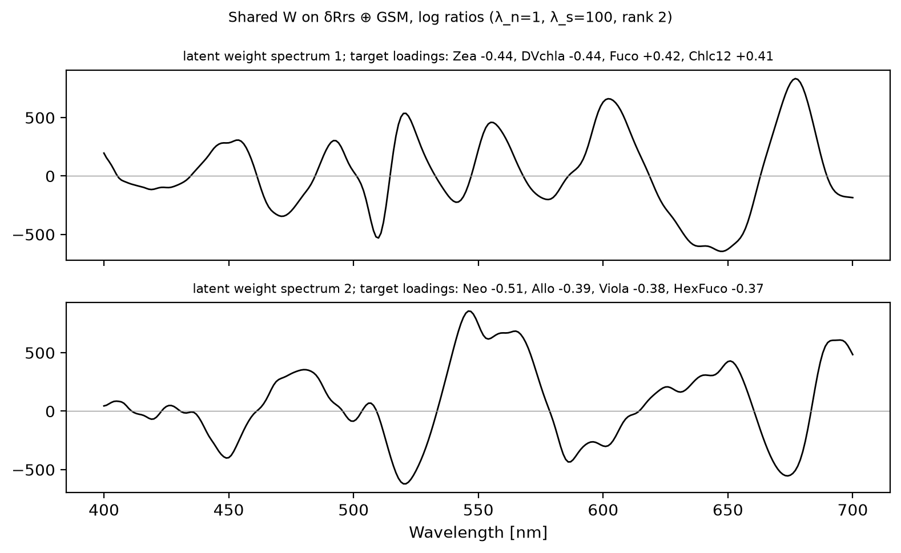

*The two shared latent weight spectra on δRrs, with each latent's largest
target loadings in its title.*

### 7.4 Which wavelengths carry the weight

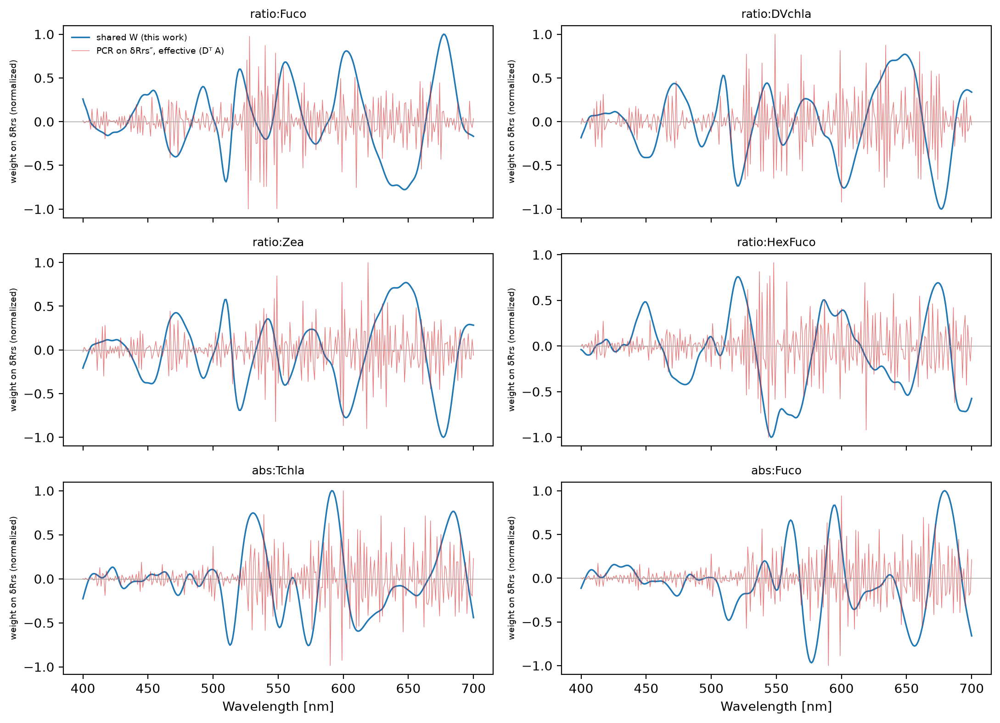

*Weight spectra on δRrs for four log ratios and two absolute pigments:
shared W (blue) vs PCR's effective $D^\top A$ (red), each normalized to its
maximum.*

- **Scale.** The shared-W weight spectra have **no** power at periods
  < 10 nm. For Fuco, Zea, DVchla and Chlc12 about 50% of the power is at
  10–40 nm periods, and the rest at longer scales. PCR's effective weights
  have 99.7% at < 10 nm. The transferable information lives at the widths
  of absorption *bands* (≈ 15–40 nm), not in the 1–5 nm curvature the second
  derivative emphasizes.
- **Location.** As shares of |w(λ)|·SD(δRrs(λ)), summed over bands:
  - Fuco:Tchla, Zea:Tchla, DVchla:Tchla and Chlc12:Tchla: about **8%** at
    400–450 nm, 14–16% at 450–500, 15–18% at 500–550, 12–17% at 550–600,
    and **≈ 46% at 600–700 nm** (23% each in 600–650 and 650–700).
  - HexFuco:Tchla leans on 500–600 nm (50%).
  - Absolute Tchla and Fuco lean on 500–600 nm (57–48%) and 650–700 nm.
- **The recurring features of latent 1:**
  - positive lobes near 445–455, 490, 520, 555, 600 and 675–680 nm;
  - negative lobes near 470, 510, 580 and a broad 630–655 nm trough.

  The 675–680 lobe sits on the chlorophyll red absorption peak and the
  683 nm fluorescence line; the GSM has no fluorescence term, so δRrs keeps
  it. The 630–655 trough overlaps chlorophyll c absorption (≈ 635 nm) and,
  for the cyanobacterial ratios, phycobilin absorption (phycoerythrin
  ≈ 545–565 nm; phycocyanin ≈ 620 nm). These assignments are suggestive,
  not demonstrated.
- **The blue matters less than expected.** Little weight sits at 400–450 nm,
  where most accessory pigments absorb, probably because δRrs is noisiest
  relative to its signal there (§5.2: SNR minimum ≈ 410 nm) and is most
  affected by the CDOM/NAP shape the GSM removes imperfectly.

### 7.5 Do the gains over PCR survive LOCO?

**Yes, for a small set of targets.** Compared with the paper's PCR on
δRrs'', the group-inner shared W:
- doubles LOCO absolute R² (0.19 → 0.39), matching the Tchla null on
  average and beating it for 3 pigments;
- raises LOCO ratio log-R² from 0.17 to 0.24;
- turns **4 ratios** (Fuco, Zea, DVchla, Chlc12; plus Perid weakly) into
  significant out-of-campaign wins over the Tchla null, against none for
  PCR (excluding the Neo artifact);
- beats a constant ratio for 10 of 12 ratios out of campaign.

The gains are modest in absolute terms: the best LOCO ratio R² values are
0.45–0.55. They come from three things, none of which is the second
derivative:
1. a smooth, noise-aware prior instead of an anti-smooth one;
2. sharing statistical strength across pigments through a low-rank W;
3. hyperparameters chosen for transfer (group inner CV).

HexFuco, ButFuco, MVchlb, Viola, Chlc3 and Allo ratios remain
indistinguishable from the null out of campaign. The haptophyte and green
algal composition is not retrievable from this dataset in a way that
transfers.

Two cautions:
- The hyperparameter grid's smoothness choice sat at the upper end (λₛ =
  100–1000). Extending the grid by two decades changed the LOCO scores by
  < 0.01, so the CV surface is flat there.
- The noise penalty assumes the in-situ-like 2% model. §8 tests robustness
  to the PACE noise models and attaches predictive uncertainties to the
  shared W.

## 8. Uncertainty

The code is in `epft_up/sdp/bayes.py` (the model and scores) and
`epft_up/sdp/noise.py` (covariances and Monte Carlo draws). The script is
`scripts/sdp/uncertainty.py`, and the outputs are `uncertainty_scores.csv`,
`uncertainty_summary.csv` and `uncertainty_summary.json`. Everything is under
leave-one-campaign-out (LOCO), so every predictive interval is for a
campaign the model never saw.

### 8.1 The Bayesian shared W

The model takes §7's best estimator, the shared low-rank W on δRrs ⊕ GSM
parameters with a noise + smoothness penalty and (λₙ, λₛ, r) chosen by inner
leave-campaign-out, and adds a Bayesian layer:

- **Cross-fitted calibration (the default).** Within each training set, the
  shared W at its selected hyperparameters is refitted leaving out one
  campaign at a time, giving out-of-campaign predictions ŷ_oof. Each
  target's Bayesian linear regression y = a + b·ŷ_oof + ε (Gaussian prior,
  type-II maximum likelihood; `sklearn.BayesianRidge`) gives a Gaussian
  predictive distribution: residual variance plus coefficient uncertainty.
  The point predictor is the full-training-set W.
- **In-sample calibration (shown for contrast).** The same Bayesian
  regression on the *in-sample* latent scores. Because the latent directions
  were fitted to these same targets, its residual variance understates the
  error, both on synthetic data (68%/95% intervals cover 48%/80%) and on the
  deposit (see below). Cross-fitting is the fix.
- **Input-noise propagation by Monte Carlo through the whole chain.** For
  each noise model, 30 noisy realizations of every spectrum are drawn. Each
  goes through noisy Rrs → GSM refit → δRrs and GSM parameters →
  prediction, so the GSM projection and the noise in the auxiliary
  parameters are included. A retrieval's total predictive SD is
  $\sqrt{\sigma^2_{\rm model} + \sigma^2_{\rm input}}$, with
  $\sigma^2_{\rm input}$ the across-draw variance of its predictive mean.
  Coverage is scored on single-draw retrievals (what an observer gets),
  pooled over the draws.
- **Noise-aware training (`aware`).** The test noise covariance enters the
  penalty with no tuning, as $n\,w^\top\Sigma_{\rm test}w$. For a linear
  predictor with standardized targets this is exactly the extra expected
  squared error that test-time noise adds (errors-in-variables ridge), so it
  costs no extra hyperparameter.

Scenarios (all with the 5 nm moving mean the paper's preprocessing implies):

| Scenario | Spectra the model is applied to |
|---|---|
| clean, 1 nm | the deposit |
| in-situ, 1 nm | + `pct:0.02` + floor (white, through the 5 nm mean) |
| PACE white, 1 nm | + ocpy's OCI σ (white per band) |
| PACE correlated, 1 nm | + smooth OCI-σ error (ℓ = 30 nm) + 10% white |
| clean, 5 nm | the deposit subsampled to 400, 405, …, 700 nm; GSM and model rebuilt at 5 nm |
| PACE white, 5 nm | + OCI σ per 5 nm band |

All models are trained on the clean deposit at the matching resolution. The
Tchla nulls are also fed the noisy spectra' GSM and OC4 Tchla, so they face
the same noise.

### 8.2 Calibration

**Log ratios (the primary target):**

| Scenario | model | 68% coverage | 95% coverage | SD of z | CRPS [dex] | model-variance-only coverage (68/95) |
|---|---|---|---|---|---|---|
| clean, 1 nm | shared W, in-sample calibration | 0.64 | 0.90 | 1.26 | 0.184 | 0.64 / 0.90 |
| clean, 1 nm | **shared W, cross-fitted** | **0.71** | **0.94** | 1.07 | 0.184 | 0.71 / 0.94 |
| in-situ, 1 nm | shared W | 0.70 | 0.94 | 1.07 | 0.194 | 0.68 / 0.93 |
| in-situ, 1 nm | shared W, aware | 0.68 | 0.93 | 1.10 | 0.198 | 0.67 / 0.93 |
| PACE white, 1 nm | shared W | 0.70 | 0.94 | 1.05 | 0.218 | **0.63 / 0.90** |
| PACE white, 1 nm | shared W, aware | 0.69 | 0.94 | 1.09 | 0.199 | 0.68 / 0.93 |
| PACE correlated, 1 nm | shared W | 0.69 | 0.94 | 1.05 | 0.235 | **0.59 / 0.88** |
| PACE correlated, 1 nm | shared W, aware | 0.69 | 0.93 | 1.10 | 0.189 | 0.67 / 0.92 |
| clean, 5 nm | shared W | 0.71 | 0.94 | 1.07 | 0.183 | 0.71 / 0.94 |
| PACE white, 5 nm | shared W | 0.70 | 0.94 | 1.05 | 0.214 | 0.64 / 0.91 |
| PACE white, 5 nm | shared W, aware | 0.69 | 0.94 | 1.08 | 0.199 | 0.68 / 0.93 |

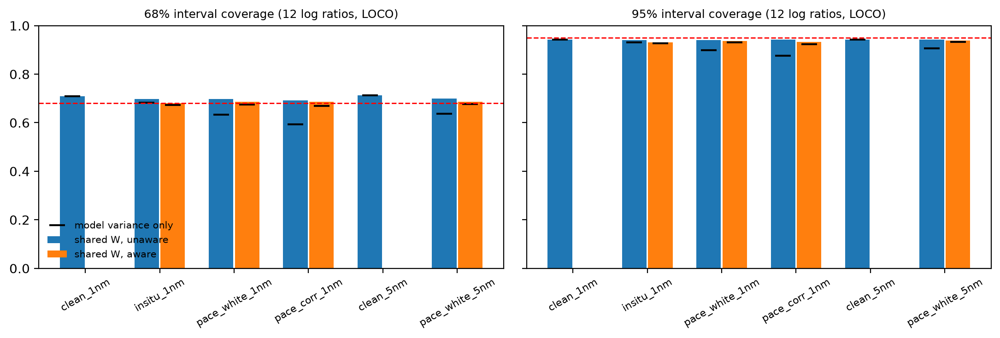

*68% and 95% interval coverage of the 12 log ratios under LOCO, by scenario,
for the shared W without and with noise-aware training. Black ticks show
coverage using the model variance alone.*

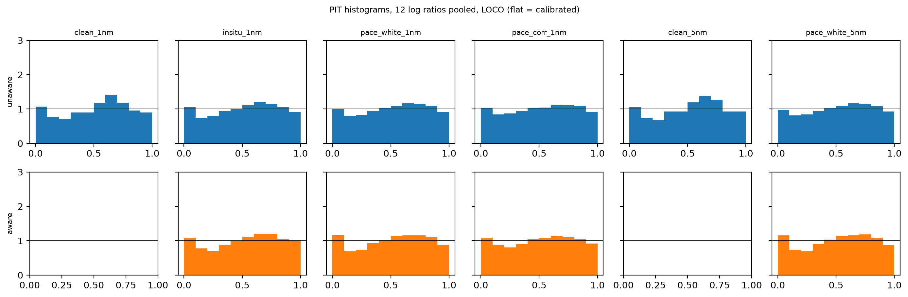

*PIT histograms for the 12 log ratios pooled, by scenario (flat = calibrated).*

Points from the table:
- **With cross-fitting and input-noise propagation, the intervals are
  calibrated out of campaign in every scenario:** 68–71% and 93–94%
  coverage, SD of standardized errors 1.05–1.10. The PIT histograms are
  close to flat. A mild hump at 0.6–0.7 shows the observations sit slightly
  above the predictive median, a small negative bias, plus a slight excess
  in the lowest bin.
- **Propagating the input noise matters.** With the model variance alone,
  coverage falls to 63/90% (PACE white) and 59/88% (PACE correlated).
- **Noise-aware training makes the model itself robust enough** that the
  model variance alone covers almost correctly (67–68 / 92–93%). It also
  lowers CRPS under PACE noise (0.218 → 0.199 white; 0.235 → 0.189
  correlated).
- **Uncertainty budget** (median 1σ, dex), for the two best-constrained
  ratios:

  | | model | + in-situ noise | + PACE white | + PACE correlated |
  |---|---|---|---|---|
  | Fuco:Tchla | 0.27 | 0.29 | 0.33 | 0.35 |
  | Zea:Tchla | 0.40 | 0.43 | 0.50 | 0.52 |

  The model term (≈ a factor 1.9–2.5 in the ratio) dominates for in-situ
  data. At OCI noise levels the input term (0.16–0.33 dex) becomes
  comparable to it.

**Absolute concentrations** are less well served by a Gaussian. The 68%
coverage is 0.82–0.87 (too wide in the core), the 95% coverage 0.94–0.95,
and the SD of z is 1.6–1.8 (heavy tails). Concentrations are skewed,
spanning two decades, so a symmetric linear-space interval is the wrong
shape. A log-normal or censored likelihood would be appropriate (the
deferred Tom Jordan model, Q&A #20). The ratios are already in log space,
which is one more reason to prefer them as the target.

### 8.3 How skill degrades: in situ → OCI noise, and 1 → 5 nm

LOCO log-R² by scenario. "Null" is the best Tchla null under the same noise,
which is the OC4 null throughout.

| Ratio | clean 1 nm: shared W / PCR / null | in-situ 1 nm: W / W-aware / PCR | PACE white 1 nm: W / W-aware / PCR / null | PACE corr. 1 nm: W / W-aware / PCR / null | clean 5 nm: W / PCR | PACE white 5 nm: W-aware / PCR / null |
|---|---|---|---|---|---|---|
| Fuco:Tchla | 0.43 / 0.42 / 0.31 | 0.39 / 0.37 / **0.01** | 0.26 / **0.36** / **0.00** / 0.27 | 0.23 / **0.45** / 0.06 / 0.26 | 0.44 / 0.46 | **0.37** / 0.01 / 0.28 |
| Zea:Tchla | 0.43 / 0.32 / 0.35 | 0.37 / 0.38 / 0.01 | 0.25 / **0.34** / 0.00 / 0.31 | 0.25 / **0.46** / 0.08 / 0.30 | 0.46 / 0.43 | **0.37** / 0.01 / 0.32 |
| DVchla:Tchla | 0.44 / 0.35 / 0.32 | 0.36 / 0.36 / 0.00 | 0.23 / **0.33** / 0.00 / 0.29 | 0.24 / **0.44** / 0.04 / 0.27 | 0.47 / 0.50 | **0.34** / 0.01 / 0.30 |
| Chlc12:Tchla | 0.42 / 0.29 / 0.27 | 0.37 / 0.38 / 0.00 | 0.24 / **0.32** / 0.00 / 0.24 | 0.21 / **0.39** / 0.05 / 0.23 | 0.42 / 0.37 | **0.34** / 0.00 / 0.24 |
| mean of 12 | 0.20 / 0.17 / 0.20 | 0.16 / 0.14 / 0.00 | 0.10 / 0.13 / 0.00 / 0.18 | 0.09 / **0.19** / 0.03 / 0.15 | 0.20 / 0.22 | 0.13 / 0.00 / 0.19 |

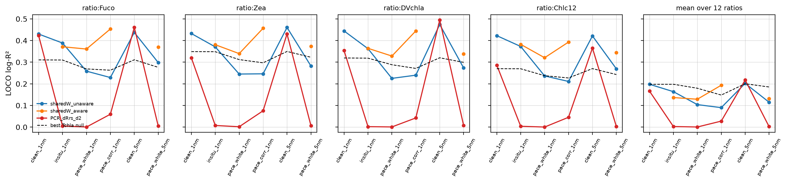

*LOCO log-R² across scenarios for four key ratios and the mean over 12: the
shared W without (blue) and with (orange) noise-aware training, Kramer's PCR
(red), and the best Tchla null (dashed).*

What degrades:
1. **The paper's PCR on δRrs'' does not survive any realistic noise.**
   Trained on the clean deposit and applied to spectra with 2% in-situ-like
   noise, PACE white or PACE correlated noise, its LOCO R² collapses to ≈ 0
   for every ratio, and to ≈ 0 for absolute concentrations (mean 0.00–0.02).
   This is §5.2's 10–15× noise amplification made concrete. SDP as
   published works only on spectra as clean as the deposit, with
   band-to-band noise around 0.1%.
2. **The shared W degrades gracefully, and noise-aware training recovers
   much of the loss.** For the four transferable ratios, from clean to
   PACE white at 1 nm, LOCO R² goes from 0.42–0.44 to 0.23–0.26 unaware and
   0.32–0.36 aware.
   - The aware model keeps beating the Tchla null for all four ratios under
     PACE white noise, by 0.03–0.09.
   - Under smooth, AC-like PACE errors it is essentially unaffected (0.39–0.46),
     while the GSM-Tchla null collapses (abs Tchla null 0.37 → 0.14). There
     the aware shared W beats the best null on 9 of 13 absolute pigments and
     6 of 12 ratios.
   - Under in-situ 2% noise, awareness neither helps nor hurts (0.16 vs 0.14
     mean).
3. **5 nm sampling costs nothing.** The clean 5 nm scores equal or exceed
   1 nm for every model: shared W mean 0.20 vs 0.20; Fuco:Tchla 0.44 vs
   0.43. PCR even improves at 5 nm (0.22 vs 0.17 mean, consistent with
   §4.2). Under PACE white noise, 5 nm and 1 nm are also equivalent (aware
   W 0.13 vs 0.13 mean; Fuco:Tchla 0.37 vs 0.36). This matches §5.2's
   degrees-of-freedom analysis: the information is at 10–40 nm scales, and
   OCI's ≈ 5 nm resolution captures it.
4. **The honest bottom line for PACE.** At ocpy's OCI noise level, a
   single-spectrum retrieval of Fuco:Tchla, Zea:Tchla, DVchla:Tchla or
   Chlc12:Tchla from the noise-aware shared W explains about a third of the
   out-of-campaign variance (R² 0.32–0.37). That is 0.03–0.09 better than a
   band-ratio Tchla model, with a calibrated ±0.33–0.50 dex (1σ) interval.
   The other eight ratios are at or below the null. Spatial or temporal
   averaging of N pixels would shrink the input term roughly by √N, toward
   the clean-spectrum skill (R² ≈ 0.43–0.47).

Caveats:
- The noise models are stand-ins. ocpy's OCI σ comes from one early L2
  granule, and how it splits between white and smooth error is unknown.
  "White" and "correlated" bracket that split.
- The predictive variance is conditional on the selected hyperparameters
  and on the deposit's campaigns being representative. LOCO tests the
  second only within these eight campaigns.
- A single noise draw per spectrum was used for training (none: training
  is on clean spectra). Training on noise-augmented spectra is an
  alternative to the analytic noise-aware penalty that was not tested.

## 9. Hold-out test: EXPORTS North Atlantic 2021 — *Execution #9*

## 10. Conclusions and recommendations — *Execution #10*
